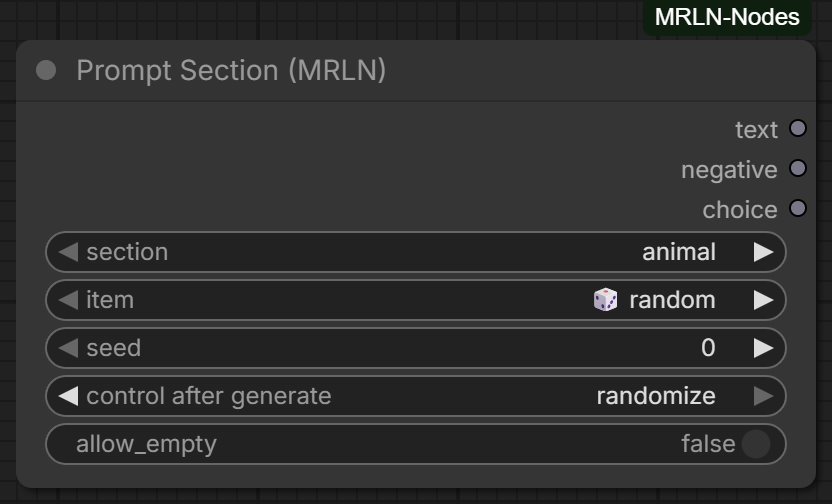
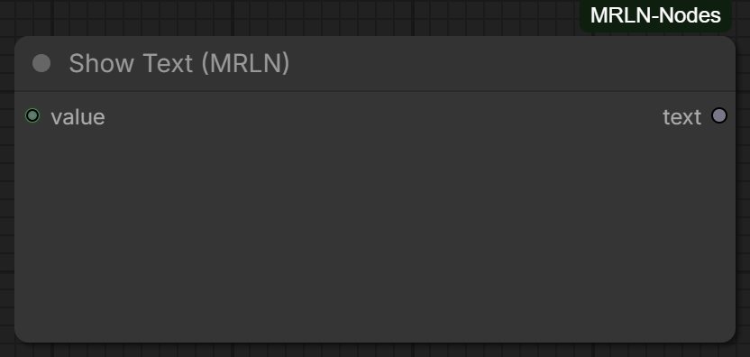
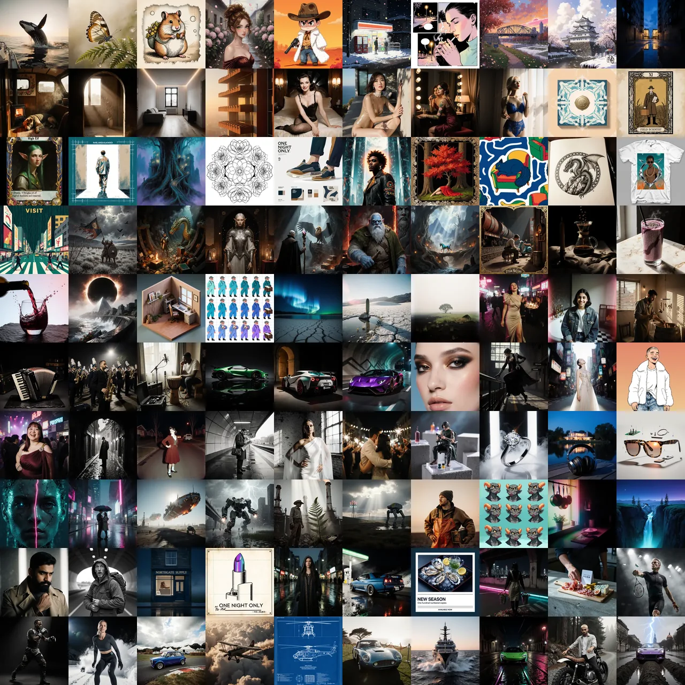
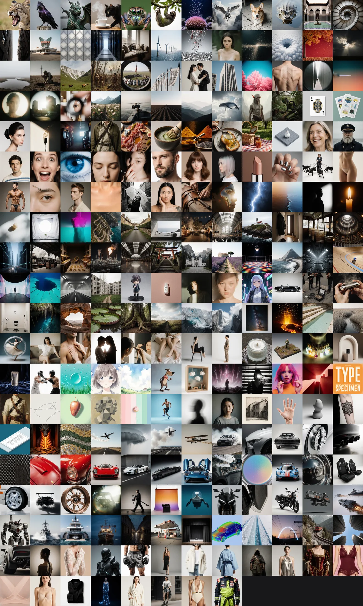

# ComfyUI-MRLN-Nodes

A multi-domain collection of custom nodes for [ComfyUI](https://github.com/comfyanonymous/ComfyUI).

> **Status: first release.** The prompt domain ships complete — engine, factory
> library, Composer sidebar, LoRA integration and LLM tooling; further node
> domains are added incrementally.

## Start here

**Prompt domain** — compose prompts from a curated JSON library instead of
retyping them: 100 templates, 237 sections, 3502 items, every one with a
thumbnail. Per-slot fixed-or-random draws on a deterministic seed, nested
draws, LoRA loading, an optional LLM pass, and a sidebar panel to drive it.

- 📖 **[Prompt Composer user guide](docs/prompt-composer-guide.md)** — what you
  can do with it, the panel tab by tab with screenshots, all three nodes
  (compose → LLM rewrite → LoRA load), recipes for the common tasks, and how to
  build a template with **nested draws** and a **combine** section. Start here
  if you want to *use* the pack.
- ▶ **Example workflows** — `mrln-prompting` opens and runs with no models
  downloaded at all; `mrln-prompting-krea2-turbo` is the same idea end to end.
- 🧩 **[Nodes](#nodes)** — what each node does, if you would rather read the
  contract than the guide.
- 🧠 **[Why this exists](#why-this-exists)** — the problem it is actually
  solving, if you are deciding whether to install it.

## Why this exists

Prompting in ComfyUI is mostly copy-paste. The good prompt you wrote last month
lives in a text file, a screenshot, or a workflow you have to open to read. When
you want it again with a different car, a different light, a different season,
you edit it by hand — and the edit is where the quality goes.

The usual answer is wildcards. They randomise *words*, but they do not know what
the words are for: a wildcard cannot tell you it just put a winter coat under a
desert sun, cannot weight one option above another, cannot be reproduced from a
seed, and cannot bring a LoRA's trigger words along with the phrase that needs
them.

So this pack treats a prompt as **composed content rather than typed text**:

- every fragment is a library **item** — with a long form and a short form, draw
  weight, tags, optional negatives, and optionally the LoRA it needs
- a **template** says which sections fill which slots, and each slot is fixed,
  random, or random-from-a-subset
- **one seed** decides every random slot, so a prompt is reproducible and a
  batch of eight is eight different draws rather than eight copies
- the whole library is **plain JSON you own** — extend a shipped section and
  pack updates still reach you

Two things follow that are the actual point. A LoRA declared on an item loads
itself, at the strength its author set, with its trigger words already in the
prompt — because they were written into the item. And a shared workflow keeps
working on a machine that has never opened the panel, since what the panel
writes into the node is plain text.

It ships with 100 templates and 3502 items so it is useful on the first render,
not after an evening of authoring. The content is opinionated on purpose:
somebody has to decide what a good documentary wildlife brief contains.

### What I hope people do with it

Build things, and pass them on.

The library that ships is a starting point, not a boundary. Anyone can add items
to a shipped section without forking it, write a template for the thing they
actually shoot, attach the LoRAs it needs, and end up with something better than
what came in the box — because they know their subject better than I do.

The part I care about is the second half: **⤓ Export** turns any template into a
single `.mrln.json`. It carries the template, only the sections you wrote (the
factory ones resolve on the other machine), and a resolvable link to every LoRA
involved rather than a copy of the weights. A template drawing 36 sections comes
out around 4 KB — small enough to attach to a Civitai post, drop in a Discord,
or ship next to a workflow.

On the other end, **Import…** dry-runs first and shows the exact write/skip plan
before anything touches disk, then offers to fetch any missing LoRA by its AIR.
So someone can take your file and reproduce your renders — same seed, same
prompt — without you having to explain anything.

If that works, the interesting content stops being what I wrote and starts being
what the community wrote. A section of shared templates on Civitai would be a
fine place for it. That is the wish.

## Install

Until the pack is on the [Comfy Registry](https://registry.comfy.org), install manually:

```bash
cd ComfyUI/custom_nodes
git clone <repo-url> ComfyUI-MRLN-Nodes
```

Restart ComfyUI afterwards. No extra Python dependencies are required: the
prompt engine and the nodes are pure standard library, and the two features
that read image files (dropping a generated image on the Composer, and
thumbnails) use Pillow and PyYAML — which ComfyUI itself ships — through soft
imports that disable just those features if the libraries are ever absent.

## Nodes

Nodes appear in the Add-Node menu under **MRLN/**, grouped by domain, and every
display name carries an `(MRLN)` marker so they are easy to find in search.
One row per node — a new node adds a row, so this list cannot quietly fall
behind what the pack ships.

| Domain | Node | What it does |
| --- | --- | --- |
| `MRLN/prompt` |  | **Prompt Template** — composes a whole prompt from the library. Every slot is fixed, random, or random from a subset you ticked, all derived from one `seed`, so the same seed and library always draw the same prompt. `batch_count` renders a batch from one queue (`increment seed` = *n* different draws, not *n* copies; `combinatorial` enumerates every combination of the still-random slots, capped at 512). `format` and `text_length` reshape the same library for tag-based or prose models; `profile` targets a model family and can swap in a tuned variant of the template *and* reorder the rendered blocks into the reading order that family rewards. Six outputs in wiring order: `prompt`, `llm`, `loras`, then the reports `negative`, `choices`, `gen_info` — the last an A1111 `parameters` string carrying only what this node actually knows, never a guessed Steps/Sampler/CFG |
| `MRLN/prompt` |  | **Prompt Enhance** — an optional LLM rewrite that cannot lose the words that matter. It takes ONE wire (`llm`), which carries the prompt, the profile's system prompt and the protected trigger words; those are enforced verbatim and re-injected if the model rewrites them. Local (Ollama / LM Studio) or cloud (Anthropic / OpenAI / Gemini / OpenRouter), deterministic per seed, VRAM handed back per choice, and `pass through` on a dead backend so a render never fails for want of an LLM. Best on thin hand-typed prompts and tag→prose conversion — the curated library usually renders better un-rewritten |
| `MRLN/prompt` |  | **LoRA Apply** — loads the LoRAs the draw selected onto MODEL/CLIP at their authored strengths. Wire the `loras` output: trigger words stay in the prompt, loading stays out of it. `on_missing` stops with the file named, skips it, or downloads it by its Civitai AIR; `on_mismatch` warns when a LoRA's base family does not match the checkpoint — which ComfyUI itself accepts silently while the image quietly degrades |
| `MRLN/prompt` |  | **Prompt Section** — one library section as a standalone node, for bolting a single random element onto a prompt you wrote yourself. Deliberately strict where the template node is forgiving: a named item that no longer exists raises instead of quietly drawing something else |
| `MRLN/text` |  | **Show Text** — displays any input as text inside the node (strings as-is, other types stringified, dicts and lists as pretty JSON) and passes the STRING through. Wire `choices` into one and you can read exactly which item every slot drew, and why |

## The prompt library

Prompt libraries are plain JSON files: the factory content ships with the pack,
your personal library lives in `<ComfyUI>/user/mrln/prompt/` and survives pack
updates. Same-name SECTIONS compound — your file *extends* the factory one by
default (same item name wins, new items append, `"hidden": true` tombstones a
factory item, `"replaces": true` opts into a full replacement). Same-name
templates replace the factory file entirely.

### What ships

**100 templates / 237 sections / 3502 curated items**, every one of them
carrying a rendered thumbnail. The dimension folders every template
shares (`location` incl. anime/sci-fi/fantasy/historical/underwater/coastal
places, `lighting` organic/dramatic/studio, `atmosphere` weather/season/mood/
particles/reentry, `viewpoint`, `camera` with film stocks and real lens/
format/technique pools plus per-genre glass, `style` with genre/movement/
anime/photography/palette/quality-boost bundles, `composition`) and subject
domains (`vehicle` — car, motorcycle, aircraft, ship, train, sci-fi craft;
`human` + `wardrobe` + `pose`; `animal` + `nature` + `creature`;
`architecture`, `food`, `product`, `battle`, `treasure`). Each item pairs a
detailed long text with a compact `text_short`, so tag-based targets get tag
flow and prose models get prose from the same library. Genre coupling runs on
tags (`anime`, `scifi`, `fantasy`, `historical`, `night`…) that templates
select with per-slot `tags_any` / `tags_none` filters.

### Templates

Every shipped template, one tile each, beside the folders they belong to. The
order is alphabetical rather than historical, the count is the whole folder,
and every template is permutation-tested seed by seed — so any draw combination
reads like a specialist wrote the brief:

<table>
<colgroup>
<col width="380">
<col width="130">
<col width="300">
<col>
</colgroup>
<thead>
<tr><th align="left">The shipped set</th><th align="left">Folder</th><th align="left">Templates</th><th align="left">What the folder gives you</th></tr>
</thead>
<tbody>
<tr><td rowspan="20" valign="top"></td><td valign="top"><strong><code>animal/</code></strong><br><sub>3 templates</sub></td><td valign="top"><sub>documentary · small-world · storybook</sub></td><td valign="top">The documentary formula — subject × behaviour × habitat × hour — plus macro worlds shot as landscapes and pets rendered in handmade media. Taxon-matched fieldcraft: the lens, distance and light change with the animal drawn</td></tr>
<tr><td valign="top"><strong><code>anime/</code></strong><br><sub>6 templates</sub></td><td valign="top"><sub>character · chibi · cinema-still · comic-page · keyvisual · slice-of-life</sub></td><td valign="top">Theatrical master shots and key visuals, character sheets, super-deformed proportions, and a laid-out comic page with real gutters and a reading order. Anime tags gate the pools, so western faces and photographic lenses cannot leak in</td></tr>
<tr><td valign="top"><strong><code>architecture/</code></strong><br><sub>5 templates</sub></td><td valign="top"><sub>blue-hour-icon · cozy-moment · golden-interior · property-listing · study</sub></td><td valign="top">From the icon at blue hour to an interior at golden hour to the shot an estate agent actually needs. Camera treatments are architectural — shift lens, one-point axis, worm's eye — not generic photography</td></tr>
<tr><td valign="top"><strong><code>boudoir/</code></strong><br><sub>4 templates</sub></td><td valign="top"><sub>pin-up · session · vanity-portrait · window-silhouette</sub></td><td valign="top">Solo, duo and couple configurations through nested model profiles. Adults only and kept at a tasteful glamour level, lint-enforced, with matching safety negatives carried by default</td></tr>
<tr><td valign="top"><strong><code>card/</code></strong><br><sub>3 templates</sub></td><td valign="top"><sub>deck-back · tarot · trading-card</sub></td><td valign="top">Cards as printed artifacts: illustration window, stat corner, numeral and title banner, symmetrical back. The frame is what makes it a card, so the frame is what the template composes</td></tr>
<tr><td valign="top"><strong><code>design/</code></strong><br><sub>10 templates</sub></td><td valign="top"><sub>album-cover · book-cover · coloring-page · logo-mark · movie-poster · seamless-pattern · sticker-sheet · tattoo-flash · tee-print · travel-poster</sub></td><td valign="top">The print-and-merch cluster, each written to the constraint that decides whether a design survives manufacture — cut line, screen palette, colour count, tileable repeat, spine and trim</td></tr>
<tr><td valign="top"><strong><code>fantasy/</code></strong><br><sub>7 templates</sub></td><td valign="top"><sub>battlefield-charge · dragon-hoard · enchanted-portrait · epic-encounter · folk-portrait · realm-vista · steampunk-workshop</sub></td><td valign="top">Archetype against mythical creature at romanticist scale, massed armies (charge / last stand / aftermath), treasure-lit interiors, realm panoramas, and the folk of a world as portrait subjects</td></tr>
<tr><td valign="top"><strong><code>food/</code></strong><br><sub>3 templates</sub></td><td valign="top"><sub>dark-mood · editorial · pour-shot</sub></td><td valign="top">Commercial food formulas: the editorial plate, the dark moody table, and the pour caught at the right millisecond — each with the surface, garnish and light that sell it</td></tr>
<tr><td valign="top"><strong><code>game/</code></strong><br><sub>3 templates</sub></td><td valign="top"><sub>concept-environment · isometric-room · pixel-sprite</sub></td><td valign="top">Assets a game can actually use: sprite sheets with real pixel discipline, true 2:1 isometric tiles, and production concept paintings</td></tr>
<tr><td valign="top"><strong><code>landscape/</code></strong><br><sub>3 templates</sub></td><td valign="top"><sub>astro-nightscape · grand · moody-intimate</sub></td><td valign="top">Landform hero shots, celestial subjects over dark landforms, and intimate weather — the small landscape that is about a mood rather than a vista</td></tr>
<tr><td valign="top"><strong><code>moment/</code></strong><br><sub>3 templates</sub></td><td valign="top"><sub>celebration · everyday · maker</sub></td><td valign="top">Human moments rather than portraits: a celebration, an ordinary day, someone making something. Reportage lenses and candid staging</td></tr>
<tr><td valign="top"><strong><code>music/</code></strong><br><sub>3 templates</sub></td><td valign="top"><sub>instrument-still · live · studio</sub></td><td valign="top">The instrument as still life, the stage under performance light, and the control room — three lighting worlds the same subject reads completely differently in</td></tr>
<tr><td valign="top"><strong><code>overdrive/</code></strong><br><sub>3 templates</sub></td><td valign="top"><sub>design-studio · full-shot · night-pursuit</sub></td><td valign="top">The OverDrive concept-car showcase: day full shot, neon-noir pursuit, design-studio reveal. The vehicle domain's flagship, and the deepest slot stack in the library</td></tr>
<tr><td valign="top"><strong><code>portrait/</code></strong><br><sub>10 templates</sub></td><td valign="top"><sub>beauty-macro · character-concept · fashion-editorial · illustrated · night-out · noir-night · period-portrait · street-candid · studio · wedding</sub></td><td valign="top">The portraiture spine — studio, editorial, beauty macro, character sheets, one hard light on pushed Delta 3200, decisive-moment street, period and wedding work. Most draw a nested model profile, so one slot fans out into a coherent person</td></tr>
<tr><td valign="top"><strong><code>product/</code></strong><br><sub>4 templates</sub></td><td valign="top"><sub>figure · hero · lifestyle-scene · teardown-sheet</sub></td><td valign="top">Commercial product photography plus the collectible figure shot (factory paint, seam lines, a real base) and the annotated exploded teardown</td></tr>
<tr><td valign="top"><strong><code>scifi/</code></strong><br><sub>6 templates</sub></td><td valign="top"><sub>android-portrait · cyberpunk-street · fleet-arrival · mecha-clash · post-apocalypse · vista</sub></td><td valign="top">Capital fleets making atmospheric entry, genre vistas, mech combat, synthetic portraiture, and the two worlds most asked for — cyberpunk street level and post-apocalypse</td></tr>
<tr><td valign="top"><strong><code>screen/</code></strong><br><sub>4 templates</sub></td><td valign="top"><sub>avatar · emote-set · thumbnail · wallpaper</sub></td><td valign="top">What gets made for screens, composed to the size it will be seen at: a PFP legible as a 32 px circle, a wallpaper with room for the clock, a thumbnail that wins at 210 px, emotes that survive at 28 px</td></tr>
<tr><td valign="top"><strong><code>showcase/</code></strong><br><sub>9 templates</sub></td><td valign="top"><sub>detail-portrait · flux1-reportage · flux2-storefront · ideogram4-type-poster · krea2-art-direction · night-machine · qwen-typographic · style-lab · zimage-bilingual-counter</sub></td><td valign="top">One per target model, each built to what that family rewards — KREA 2's art-direction layering, FLUX.1's early-token weighting, FLUX.2's structured scene plus lettering spec, Qwen-Image's layout control, Z-Image's all-positive bilingual phrasing, Ideogram 4.0's JSON caption. Each pins its own profile, so picking the template already targets the model. detail-portrait, night-machine and style-lab do the same for the LoRA Lab</td></tr>
<tr><td valign="top"><strong><code>sport/</code></strong><br><sub>3 templates</sub></td><td valign="top"><sub>action · discipline-study · winter</sub></td><td valign="top">The decisive athletic moment, the discipline studied as craft, and winter sport — long glass, panning, and the weather that comes with it</td></tr>
<tr><td valign="top"><strong><code>vehicle/</code></strong><br><sub>8 templates</sub></td><td valign="top"><sub>apex-attack · aviation-shot · blueprint-sheet · heritage-classic · maritime-shot · night-ride · rider-lifestyle · terrain-run</sub></td><td valign="top">Motorsport at the limit, neon-noir motion, classic-car portraiture with your own LoRA trigger, aircraft and vessels crossed with state and weather, any machine as an annotated technical sheet, motorcycle culture with an optional nested rider, and off-road terrain</td></tr>
</tbody>
</table>

### Sections

Sections are the pools templates draw from, and every shipped one carries a thumbnail too. A template names a section per slot; you extend any of them without forking, and your additions survive pack updates:

<table>
<colgroup>
<col width="380">
<col width="130">
<col width="200">
<col width="100">
<col>
</colgroup>
<thead>
<tr><th align="left">The shipped set</th><th align="left">Folder</th><th align="left">Sections</th><th align="left">Items</th><th align="left">What it covers</th></tr>
</thead>
<tbody>
<tr><td rowspan="26" valign="top"></td><td valign="top"><strong><code>animal/</code></strong><br><sub>10 sections</sub></td><td valign="top"><sub>behavior · bird · dragon · hearthside · insect-macro · +5 more</sub></td><td valign="top">226</td><td valign="top">Species and behaviour: mammals, birds, reptiles, insects at macro, marine life, dragons and mythical creatures, pets, and what the animal is doing</td></tr>
<tr><td valign="top"><strong><code>architecture/</code></strong><br><sub>8 sections</sub></td><td valign="top"><sub>building · detail · ensemble · era · facade · +3 more</sub></td><td valign="top">129</td><td valign="top">Buildings and their parts — facade, detail, ensemble, interior, era and structure — plus the snug interiors that carry a mood rather than a form</td></tr>
<tr><td valign="top"><strong><code>atmosphere/</code></strong><br><sub>7 sections</sub></td><td valign="top"><sub>battle-debris · mood · particles · reentry · season · +2 more</sub></td><td valign="top">84</td><td valign="top">The air in the shot: weather, season, time of day, particles, mood, and battle debris or re-entry for the dramatic end of the range</td></tr>
<tr><td valign="top"><strong><code>battle/</code></strong><br><sub>5 sections</sub></td><td valign="top"><sub>focal · ground · host · moment · standard</sub></td><td valign="top">55</td><td valign="top">The elements of a battle scene — the host, the ground, the standard, the focal figure and the decisive moment</td></tr>
<tr><td valign="top"><strong><code>boudoir/</code></strong><br><sub>1 section</sub></td><td valign="top"><sub>configuration</sub></td><td valign="top">3</td><td valign="top">Configuration only: solo, duo and couple staging that other templates nest. Adults only, tasteful glamour, lint-enforced</td></tr>
<tr><td valign="top"><strong><code>camera/</code></strong><br><sub>10 sections</sub></td><td valign="top"><sub>architecture-view · film · format · lens · macro-rig · +5 more</sub></td><td valign="top">128</td><td valign="top">Real photography: film stocks, formats, lenses, techniques and settings, plus per-genre glass — architecture views, portrait glass, macro rigs, wildlife field kit</td></tr>
<tr><td valign="top"><strong><code>composition/</code></strong><br><sub>2 sections</sub></td><td valign="top"><sub>framing · vista</sub></td><td valign="top">31</td><td valign="top">How the frame is organised — framing devices and vista construction</td></tr>
<tr><td valign="top"><strong><code>creature/</code></strong><br><sub>3 sections</sub></td><td valign="top"><sub>alien-fauna · folk · synthetic</sub></td><td valign="top">44</td><td valign="top">Non-human characters: alien fauna, synthetic beings, and the folk of a fantasy world</td></tr>
<tr><td valign="top"><strong><code>design/</code></strong><br><sub>2 sections</sub></td><td valign="top"><sub>card · merch</sub></td><td valign="top">16</td><td valign="top">Graphic-design substrates — the card and the merch surfaces a design has to survive being printed on</td></tr>
<tr><td valign="top"><strong><code>era/</code></strong><br><sub>4 sections</sub></td><td valign="top"><sub>hair · media · signature · wardrobe</sub></td><td valign="top">70</td><td valign="top">Period signalling that holds together: the hair, the wardrobe, the media it would have been shot on, and the signature detail that dates a scene</td></tr>
<tr><td valign="top"><strong><code>food/</code></strong><br><sub>5 sections</sub></td><td valign="top"><sub>dish · drink · ingredient · moment · styling</sub></td><td valign="top">90</td><td valign="top">The dish, the drink, the ingredient, the styling and the moment — the four things a food photograph is actually made of</td></tr>
<tr><td valign="top"><strong><code>game/</code></strong><br><sub>1 section</sub></td><td valign="top"><sub>asset</sub></td><td valign="top">8</td><td valign="top">Game-asset conventions for sprites, tiles and props</td></tr>
<tr><td valign="top"><strong><code>human/</code></strong><br><sub>22 sections</sub></td><td valign="top"><sub>age · archetype · bust · ethnicity · expression · +17 more</sub></td><td valign="top">357</td><td valign="top">The largest subject domain: age, archetype, ethnicity, expression, gaze, gesture, hair, skin, eyes, makeup, nails, tattoos, piercings, physique, profile and trade</td></tr>
<tr><td valign="top"><strong><code>lighting/</code></strong><br><sub>8 sections</sub></td><td valign="top"><sub>day · dramatic · epic · night · organic · +3 more</sub></td><td valign="top">103</td><td valign="top">Organic, dramatic, studio, epic, day, night and still-life light, plus the quality words that describe how it falls</td></tr>
<tr><td valign="top"><strong><code>location/</code></strong><br><sub>25 sections</sub></td><td valign="top"><sub>aerial · automotive · boudoir-interior · celebration · civic · +20 more</sub></td><td valign="top">452</td><td valign="top">Where it happens — urban, nature, interior, coastal, aerial, industrial, civic, domestic, nightlife, celebration, historical, fantasy, sci-fi, underwater and more</td></tr>
<tr><td valign="top"><strong><code>loralab/</code></strong><br><sub>6 sections</sub></td><td valign="top"><sub>anime-style · detail-boosters · film-look · portrait-realism · scifi-style · +1 more</sub></td><td valign="top">19</td><td valign="top">Community LoRAs curated as ordinary items: detail boosters, film looks, portrait realism, sci-fi and anime style movers, vehicle icons</td></tr>
<tr><td valign="top"><strong><code>music/</code></strong><br><sub>3 sections</sub></td><td valign="top"><sub>ensemble · instrument · performance</sub></td><td valign="top">58</td><td valign="top">The instrument, the ensemble and the performance — three lighting worlds the same subject reads differently in</td></tr>
<tr><td valign="top"><strong><code>nature/</code></strong><br><sub>11 sections</sub></td><td valign="top"><sub>cave · desert · flora · forest · grassland · +6 more</sub></td><td valign="top">142</td><td valign="top">Landform and living cover: forest, desert, mountain, water, wetland, cave, grassland, flora, ice and polar, volcanic, and the celestial sky</td></tr>
<tr><td valign="top"><strong><code>pose/</code></strong><br><sub>8 sections</sub></td><td valign="top"><sub>action · boudoir-solo · couple · couple-interaction · duo · +3 more</sub></td><td valign="top">106</td><td valign="top">What the body is doing — action, seated, standing, couple and duo, with interaction variants for scenes with two people</td></tr>
<tr><td valign="top"><strong><code>product/</code></strong><br><sub>5 sections</sub></td><td valign="top"><sub>category · collectible · prop · staging · surface</sub></td><td valign="top">85</td><td valign="top">Commercial product work: the category, the surface under it, how it is staged, props, and the collectible figure</td></tr>
<tr><td valign="top"><strong><code>sport/</code></strong><br><sub>1 section</sub></td><td valign="top"><sub>discipline</sub></td><td valign="top">45</td><td valign="top">The disciplines, deep enough that the equipment, surface and body language match the sport drawn</td></tr>
<tr><td valign="top"><strong><code>style/</code></strong><br><sub>23 sections</sub></td><td valign="top"><sub>aesthetic · anime · anime-cinema · cartoon-comics · craft-medium · +18 more</sub></td><td valign="top">319</td><td valign="top">Genre, movement, medium, palette, grade, rendering, line art, print, tattoo, anime and cartoon idioms, photography and portrait treatments, headline type</td></tr>
<tr><td valign="top"><strong><code>treasure/</code></strong><br><sub>2 sections</sub></td><td valign="top"><sub>moment · trove</sub></td><td valign="top">19</td><td valign="top">Hoards and the moment of finding one</td></tr>
<tr><td valign="top"><strong><code>vehicle/</code></strong><br><sub>44 sections</sub></td><td valign="top"><sub>aircraft/moment · aircraft/sky · aircraft/state · aircraft/type · car/action · +39 more</sub></td><td valign="top">600</td><td valign="top">The deepest domain: cars down to caliper colour, paint finish, stance, aero and interior; motorcycles, aircraft, ships, trains, sci-fi craft; plus the stages, terrain, craft optics and technical-sheet treatments they are shot in</td></tr>
<tr><td valign="top"><strong><code>viewpoint/</code></strong><br><sub>3 sections</sub></td><td valign="top"><sub>dynamic · general · portrait</sub></td><td valign="top">41</td><td valign="top">Where the camera stands — general, dynamic and portrait viewpoints</td></tr>
<tr><td valign="top"><strong><code>wardrobe/</code></strong><br><sub>18 sections</sub></td><td valign="top"><sub>accessories · armor · athletic · business · casual · +13 more</sub></td><td valign="top">272</td><td valign="top">Clothing by register: business, casual, streetwear, glamour, athletic, cultural, historical, fantasy, sci-fi, armor, uniform, sleepwear, swimwear and lingerie</td></tr>
</tbody>
</table>

The human-domain content is strictly adults-only and kept at a tasteful
glamour level (lint-enforced); templates carry matching safety negatives by
default.

### LoRA Lab

`loralab/*` sections curate well-known community LoRAs as ordinary library
items — detail boosters, film looks, portrait realism, sci-fi and anime style
movers, and vehicle icons — each with its trained trigger woven into the item
text, its authored strengths, and its Civitai AIR urn. `showcase/detail-portrait`,
`showcase/night-machine` and `showcase/style-lab` put them to work end to end: compose, and the drawn
LoRAs leave through the `loras` output into **LoRA Apply** while their trigger
words ride the prompt; a file you don't have yet is offered for download by
its AIR, verified by SHA256, and the item is healed to point at it. Every
LoRA-bearing slot pins exactly one base-model family by tag, so a random draw
can never stack a Flux LoRA onto an SDXL render.

A LoRA item may carry `data.lora_info` — `{name, creator, base, url, about}`
— a render-inert provenance card naming the model, its creator, its base
family, its Civitai page and what it does. It never reaches the prompt or any
output wire; it exists so the Composer can tell you where a file came from
and why it is on the list.

Factory updates never strand your saved templates: renamed section slugs
keep resolving through shipped aliases, and a template whose section
genuinely vanished still loads and runs — the dead slot is skipped with a
loud ⚠ in the choices output, and the Composer offers a one-click remap.

## The Composer panel

> Walked tab by tab with screenshots in the
> **[user guide](docs/prompt-composer-guide.md)**.

On frontends with the sidebar-extension API, the pack adds a **Prompt
Composer** sidebar tab: browse the library, pick items per slot, watch a live
preview (prompt / negative / choices) as you click, then *Apply to node* — it
writes the plain selection lines into a Prompt Template node, so workflows stay
fully shareable and headless-safe. With one such node in the graph it is
targeted automatically; with several, select the one you mean first — the panel
refuses rather than guessing.

### Compose

The compose table is one row per draw — state · section · drawn value ·
weight · seed · actions — with the panel's own value picker in place of the
browser dropdown: a filter over 200+ items, the two *modes* (`random`, `off`)
pinned above the content instead of buried in it, each item's draw weight on
the row, and a link straight to the section it came from. Clicking a row
selects it, after which **E** edits, **↑ ↓** reorder and **Del** removes.
Click the state glyph to hold a draw on the seed it just used; click the seed
to pin it, double-click to type one.

**Random from a subset.** A slot's random can draw from the whole section or
from items you tick — the picker's `full` / `selected` switch, with all-on and
all-off above the list. It is stored on the template (`slot.include`), not on
the node, so the node honours it headless.

**Target profiles.** 29 shipped profiles describe what one model family
rewards — `flux`, `krea2`, `sdxl`, `sd15`, `pony`, `illustrious`, `qwen-image`,
`zimage`, `ideogram4` and more. Choosing one changes the render **format**, the
**text length** (long form or each item's `text_short`), the **block reading
order**, and the **negative policy** — `drop` for families that do not use a
negative prompt at all — and it emits that family's **LLM system prompt** on the
`llm` output. Precedence is *explicit widget > profile > template*, so leaving
`format` and `text_length` on `template default` is what lets a profile do its
job. `standard` is the neutral baseline and always the way back. Profiles live
in `profiles.json` in both tiers and can be extended per template, including a
sparse `overrides` block that makes one template read differently for one
target without a second copy on disk.

**Emphasis and variants.** A slot can carry an emphasis multiplier (`×1.2`),
rendered in whatever weighting syntax the target format uses — so the same
template emphasises correctly for a tag model and a prose one. A template can
also carry **variants**: alternative slot sets under one name, drawn on the same
seed or pinned like any other row. `animal/documentary` has one per taxon,
because a mammal brief and a bird brief need different behaviour and habitat
pools.

**Read the factory version under your own.** A user file shadows the factory
file of the same slug everywhere — that is the point of the two tiers. Where
both exist, the tier pill becomes a switch: read what you are shadowing, in
the Compose tab and in either editor. Rendering it is the single explicit
exception, written only when you *Apply to node* from that view (the template
value picks up a `factory:` prefix, which the node resolves back).
The Library tab edits sections with a form — merged factory+user views mark
each item's tier (F/U), factory items can be hidden/restored, and saving
defaults to a thin "extend factory" diff that survives pack updates (full
replace available per save) — and templates as validated raw JSON;
**New section…** and **New template…** start net-new compositions from a
blank slate (the green ＋ next to the template picker does the same).
**New combine…** groups several sections into one draw pool: pick the
sections, give each a weight, and every entry delegates to its source —
one slot then draws "urban *or* nature *or* studio". Re-opening such a
section returns to that pick-and-weight view rather than a table of
delegations.

A template that draws LoRA items warns you *before* you render: the
Compose tab lists any `.safetensors` this machine is missing and offers
a one-click fetch for the ones carrying a Civitai AIR. The same audit
runs at server start (it logs what is missing), and **LoRA Apply** has an
`on_missing` choice — stop with a named file, skip it and render without,
or download it by its AIR — so a shared workflow can heal itself without
the Composer ever being opened.

**Optimize for a model without duplicating the template.** Reading order
changes results, and one template cannot store a copy per target — so order
is a render-time function of the profile. The Compose tab's *Optimize for…*
select renders the current and the target profile side by side, lists the
reading order with the blocks that moved, and separates "the order changed"
from the things that are not order (format, negative policy, a different
draw). If you want the new order made permanent, one explicit button writes
it into a copy — never automatically.

### De-compose

LoRA blocks also declare the base model they were trained for (`data.base`,
or the ecosystem segment of their AIR). LoRA Apply reads the architecture of
the connected model and, via `on_mismatch`, warns / skips / stops when they
disagree — a FLUX LoRA on an SDXL checkpoint loads without any error from
ComfyUI and simply degrades the image, which is otherwise invisible. The
De-compose tab works the other way around: paste a finished prompt and it
is decomposed against your library — matched fragments become slots pinned
to their items, the residue becomes new items, new sections, or
prefix/suffix prose, and one click stores the whole mapping as a template.
Three engines: `programmatic` (offline token matcher), `llm` (a configured
local or cloud backend splits and maps against the library catalog) and
`hybrid` (the programmatic result rides in the LLM system prompt as
suggestions to verify or correct); every LLM assignment is validated
against the real library, and a failing backend falls back to the
programmatic result instead of erroring.

**Start from an image you like.** Drop a generated PNG/JPEG/WebP on the
De-compose tab (or paste its civitai.com URL) and the metadata it carries is
read server-side — A1111 / Forge / Civitai `parameters`, an embedded ComfyUI
graph, or EXIF `UserComment`. You then pick one of two things to do with it,
and the panel never decides for you: **Use as-is** builds a template that
reproduces that prompt byte for byte (no LLM on this path, so it works with
every backend unset), or **Decompose** hands the extracted text to the
de-composer above. Inline `<lora:…>` tags are lifted out and resolved to
local files or Civitai AIRs. When an embedded graph is genuinely ambiguous
about which string is the positive, you get a picker rather than a guess.

### Library

**Trigger words get mute/solo.** A LoRA's full trained-word list is
provenance and is never edited; the words that actually render are the
truth. Muting one drops it, soloing collapses to the rest muted, and the
state round-trips through the file itself, so re-opening the editor
re-derives it with nothing to lose. A LoRA whose trigger is baked in (or
unwanted) can mute all of them and contribute no text at all while still
loading its weights.

**Thumbnails.** Every shipped section and template carries a 256 px webp tile
— 337 of them, ~2.5 MB for the whole set — and the Library tab opens as a card
grid (rows are one click away, and the choice is remembered). Clicking an entry
opens its editor *under that entry* with the rest of the group stepped aside,
so the editor cannot open somewhere off-screen in a 237-section list. Drop or paste an
image to set one; *reset to factory* removes yours and the shipped one
reappears. A LoRA downloaded from Civitai brings its own preview along
(PG/PG-13 only, and nothing at all rather than something you did not ask
for). Your thumbnails live in the user tier, so a pack update can neither
overwrite nor delete them.

**Coming from A1111 or a wildcard collection?** **Migrate…** in the Library
tab reads wildcards
— a folder of `.txt`/`.yaml` files, or the `.zip` a published pack actually
ships as — or an A1111 `styles.csv`, and dry-run the result through the same
plan preview the bundle importer uses, so you see exactly what would be
written before anything is. Weighted lines (`3::rare option`) are honored,
and the plan says plainly which third-party syntax survives the trip and
which does not.

Wildcard packs also import straight from Civitai: paste the link of a
model of type **Wildcards** and the pack is downloaded, checked against
the SHA256 Civitai publishes, and planned like any other import — with the
creator's licence terms shown *before* anything is written. The API key is
only needed for packs that require an account; it rides an Authorization
header and never the URL.

Templates and sections travel: every template/section row offers **⤓
Export**, which bundles the template together with all your user-tier
sections it draws from (factory content resolves on the other install)
plus the Civitai AIR links of any LoRAs involved. **Import…** dry-runs the
bundle first — you see exactly what will be written, colliding files are
kept unless you opt into overwrite — and opening the imported template
offers to auto-download missing LoRA files. Share the bundle next to your
workflow and the recipient rebuilds your renders end to end.

### History

**History.** Every render the Prompt Template node makes is recorded as one
line — newest first, with restore (template, profile, seed, mode, selection,
variables, format, length and conflict policy, all nine, so it reproduces
rather than approximates) and copy-prompt — or **apply**, which restores it and
writes it straight to the node in one click. Each row carries a mini thumbnail
of the render it produced, matched automatically (ComfyUI writes the template
and seed into every PNG it saves, which is the pair the history line already
records — nothing to wire). A batch collapses to one row, and can be deleted as
one; a single row can be deleted on its own.
Recording and retention are settings, clearing is a two-step confirm, and a
failed history write can never break a render that already succeeded.

### Settings

An optional **Civitai API key** unlocks the parts that talk to Civitai — LoRA
lookup by file hash (trigger words, AIR, base family), preview images, downloading a
missing LoRA, importing a Wildcards pack, and de-composing from a civitai.com image
link. Public content works without one; a key is what reaches anything gated behind
an account, and the panel names the field when Civitai answers 401 or 403.

The Settings tab holds the local backend URLs (Ollama / LM Studio,
auto-validated with installed-model lists, each with a checkbox that takes it
out of circulation entirely — cleared, a backend is never contacted, not even
to check, and the Enhance node refuses it by name instead of timing out), the
cloud API keys — stored
server-side in your user tier, never echoed back and never written into
workflows — the history retention controls, and the switch that allows an
LLM backend on another machine (off by default: ComfyUI itself makes that
request, so a non-loopback URL turns the box into a probe for whatever
address is in the field). On frontends without the API the panel simply
doesn't appear — the nodes work identically without it.

The panel talks to the pack's own endpoints under `/mrln/prompt/*`
(registered only inside a running ComfyUI). The library is shared per
installation — in `--multi-user` setups all users see the same library.

## Example workflows

The pack ships ready-made graphs in `example_workflows/` — they appear in
ComfyUI's workflow template browser under this pack's name.

**mrln-prompting** is the starter and downloads nothing: a Prompt Template and
a Prompt Section wired into Show Text nodes, so you can explore the library,
seeds and selection lines before connecting anything to a sampler. It runs on
a fresh install with no models at all.

**mrln-prompting-krea2-turbo** is the same idea end to end — compose, optional
LLM rewrite, 8-step render. It needs the Krea-2 Turbo models, named with
download links in a note inside the graph. Like the starter, it uses nothing but
this pack and core ComfyUI.

## Design principles

- **Compatible by default** — nodes use the stable ComfyUI class API and
  server-side UI features (tooltips, descriptions, widget options), so they work
  identically in the legacy frontend and the new Nodes 2.0 UI, with no fragile
  frontend patching.
- **Zero-dependency core** — the pack installs nothing beyond what ComfyUI
  ships; domains that need optional libraries disable themselves gracefully
  when the library is missing instead of breaking the pack. Anything ComfyUI
  already guarantees (Pillow, PyYAML) is used through a soft import and never
  appears in `requirements.txt`, so installing this pack can never change the
  versions your other nodes depend on.
- **Stable node IDs** — node IDs (`MRLN_*`) are part of your saved workflows
  and are never renamed once released.

## Repository layout

```
__init__.py          # ComfyUI entry point (thin re-export shim)
mrln/
  pack.py            # pack identity: ID prefix, display marker, category root
  registry.py        # domain activation + fault-tolerant aggregation
  promptapi/         # /mrln/prompt/* endpoints (soft-fails outside ComfyUI)
  promptlib/         # prompt engine (pure Python, zero dependencies)
  nodes/             # one module per domain (prompt.py, text.py, ...)
  data/prompt/       # factory prompt library (sections + templates + thumbs)
web/js/              # Prompt Composer sidebar panel (progressive enhancement)
  composer/          # its modules — one per tab/concern, no side effects
```

## Acknowledgements

Parts of the factory library's coverage were validated against, and a small
number of pool themes informed by, these openly licensed collections:

- [Awesome-AI-Image-Prompts](https://github.com/devanshug2307/Awesome-AI-Image-Prompts) (MIT)
- [nanobanana-trending-prompts](https://github.com/jau123/nanobanana-trending-prompts) (CC BY 4.0)
- [ComfyUI-Style-Prompts-Collection](https://github.com/vaulthunt3r/ComfyUI-Style-Prompts-Collection)
  served as a taxonomy reference (all texts in this pack are original)

All factory texts were authored for this pack; no collection content was
imported verbatim.

## License

[MIT](LICENSE)
