# The Prompt Composer — a guide

The Composer is a sidebar panel (the book icon) that browses the prompt
library, composes a prompt from it, and writes the result into a **Prompt
Template (MRLN)** node. Nothing it does is magic: everything you see here ends
up as plain JSON in your user library and plain text in the node, so a
workflow you share still runs on a machine that has never opened this panel.

## What you can actually do with it

Concretely, and all of it without leaving the panel:

- **Roll a whole prompt** from 100 templates over 237 sections, and re-roll any
  single part of it without disturbing the rest
- **Hold what you like, let the rest move** — pin one slot's value, or its
  seed, and keep rolling the others until the whole thing lands
- **Restrict a random slot to a subset** you tick, so "random location" means
  random *from these nine*
- **Queue a batch of genuinely different prompts** — `batch_count 8` is eight
  different draws, not eight copies
- **Add your own items to a shipped section** without forking it: your file
  extends the factory one, and pack updates still reach you
- **Build an item that draws its own sub-slots** (a nested draw), so one pick
  fans out into a coherent set of picks
- **Merge several sections into one draw pool** (a combine) with weights
- **Attach a LoRA to an item**, so drawing that item loads its weights and
  keeps its trigger words verbatim
- **Rewrite the result through a local or cloud LLM** without losing the words
  that must survive
- **Take a prompt you already have apart** and file its pieces into your
  library (De-compose)
- **Reproduce any past render exactly** from History
- **Share a template as one file** — the bundle carries the sections it needs
  and resolvable links to the LoRAs, so someone else can rebuild your renders

The rest of this guide is the five tabs in the order you meet them, the three
nodes they drive, and then the two things that are hard to discover on your
own — **nested draws** and **combine sections**.

- [The three nodes](#the-three-nodes)
- [Compose](#compose)
  - [The template bar](#the-template-bar)
  - [The setup grid](#the-setup-grid)
  - [The draw table](#the-draw-table)
  - [The value picker](#the-value-picker)
  - [Random from a subset](#random-from-a-subset)
  - [Editing a row](#editing-a-row)
  - [Preview, choices, apply](#preview-choices-apply)
  - [Variants](#variants)
  - [Optimize for](#optimize-for)
  - [Profiles](#profiles--telling-it-which-model-you-are-rendering-with)
- [De-compose](#de-compose)
- [Library](#library)
  - [Editing a section](#editing-a-section)
  - [Nested draws: an item that draws its own slots](#nested-draws)
  - [Combine: one slot, several sections](#combine)
  - [Building a template from scratch](#building-a-template)
  - [Sharing a template — export and import](#sharing-a-template--export-and-import)
- [History](#history)
- [Settings](#settings)
- [Recipes](#recipes)

---

## The three nodes

The panel drives one node, but the domain ships three, and the full picture is
what the three do *together*: one composes, one rewrites, one loads weights.

```
                    ┌──────────────────────────┐
                    │  Prompt Template (MRLN)  │
                    └──┬────┬─────┬────────────┘
        prompt ────────┘    │     │
                            │     └──── negative / choices / gen_info → Show Text
        llm ────────────────┘
          │                            ┌───────────────────────┐
          └───────────────────────────►│ Prompt Enhance (MRLN) │──► prompt
                                       └───────────────────────┘
        loras ─────────────────────────┐
                                       ▼
                              ┌────────────────────┐
          MODEL / CLIP ──────►│ LoRA Apply (MRLN)  │──► MODEL / CLIP + report
                              └────────────────────┘
```

Wire only what you need: `prompt` alone is a complete workflow. Everything
below is optional and additive.

### Prompt Template (MRLN) — the composer

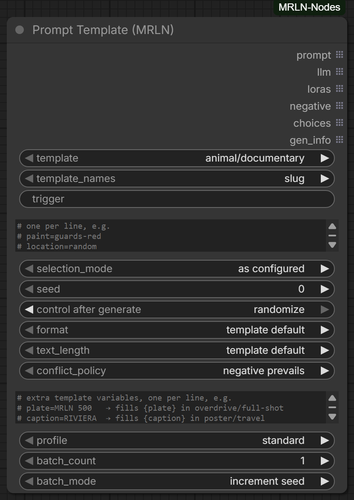

The panel is a convenience. The node is the contract, and it reads top to
bottom in the order the work happens:

| Widget | What it decides |
| --- | --- |
| `template` | which composition to render |
| `template_names` | whether the widget above lists **slugs** (`portrait/studio` — the stable identifier, and what a shared workflow should carry) or **labels** (`Studio Portrait`) |
| `trigger` | fills `{trigger}` everywhere — usually your LoRA's trained word |
| `selection` | one `slot=value` per line; this is what *Apply to node* writes |
| `selection_mode` | `as configured` honours those lines · `randomize all` re-rolls everything · `all fixed defaults` pins every slot to its template default |
| `seed` | every random slot is derived from it, so the same seed and library always draw the same prompt |
| `format`, `text_length`, `conflict_policy` | the shape of what comes out |
| `variables`, `profile`, `batch_count`, `batch_mode` | extra `{name}=value` lines, the target-model profile, and batching |

Outputs are grouped by what you wire them to: **`prompt`**, **`llm`**,
**`loras`** first, then the reports **`negative`**, **`choices`**,
**`gen_info`**.

| Output | Wire it to | What it carries |
| --- | --- | --- |
| `prompt` | your positive conditioning | the rendered prompt |
| `llm` | **Prompt Enhance (MRLN)** | one wire: the prompt, the profile's system prompt, and the words that must survive a rewrite |
| `loras` | **LoRA Apply (MRLN)** | JSON list of the LoRA blocks the draw selected |
| `negative` | your negative conditioning | the template's negatives plus anything a drawn item added |
| `choices` | a Show Text | every slot and what it drew — the fastest way to learn why a prompt looks the way it does, and where stale-pick warnings appear |
| `gen_info` | a Show Text / metadata | template, seed, mode and profile for the render |

### Prompt Enhance (MRLN) — the rewrite

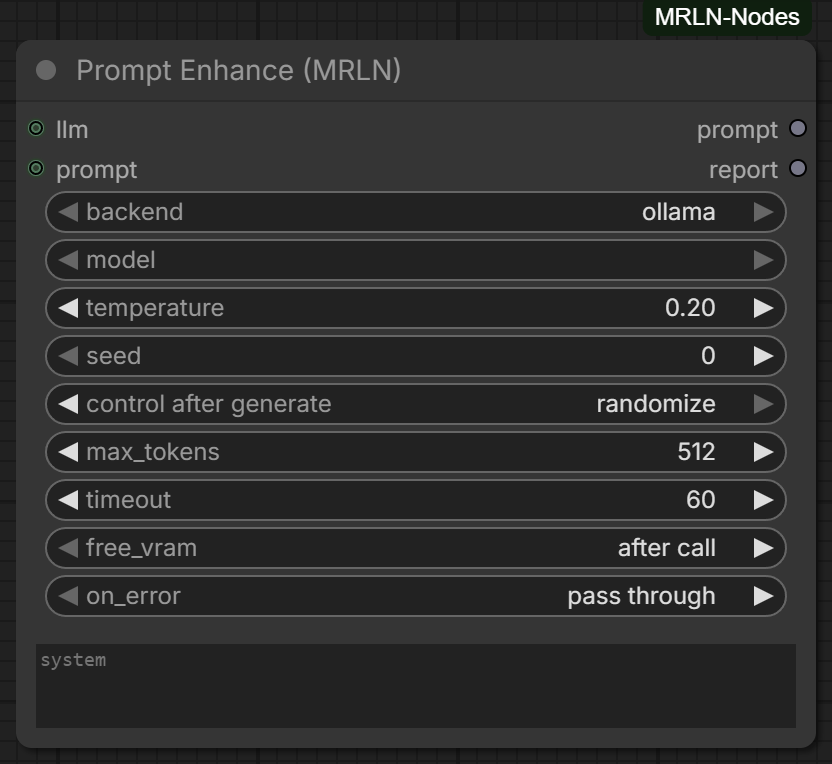

An LLM pass that improves the wording **without losing the words that carry
meaning**. That is the whole reason it takes the `llm` wire instead of a plain
string: the wire carries the prompt, the template profile's system prompt, and
a `protect` list — your trigger words, LoRA activators, product names — which
the node instructs the model to reproduce verbatim.

What you set on it:

| Widget | What it decides |
| --- | --- |
| `backend` | `ollama` · `lm studio` · a cloud backend. Local URLs and cloud keys live in the Composer's **Settings** tab, never in the node |
| `model` | e.g. `gemma3:12b`. Required for Ollama; LM Studio falls back to whatever it has loaded |
| `temperature` | keep it low — this is a faithful rewrite, not a brainstorm |
| `seed` | reproducible rewrites where the backend supports it. `0` derives a stable seed from the prompt itself, so identical input enhances identically |
| `max_tokens` | auto-raised when the input is longer than the cap, because a keep-everything rewrite can never be shorter than its input |
| `free_vram` | Ollama `keep_alive`. **`after call`** hands the VRAM straight back to the diffusion model — the right default on one GPU |
| `on_error` | **`pass through`** sends the ORIGINAL prompt on when the backend is unreachable, so the render never dies because Ollama was not running. `raise` stops the queue instead |

Two optional inputs make it useful outside this pack: `prompt` enhances any
string you wire in (it wins over the `llm` input), and `system` overrides the
profile's system prompt (the template guides, you decide).

The second output, `report`, says what happened — which backend answered, what
it cost, whether protected words survived, and why it passed through if it did.

### LoRA Apply (MRLN) — weights that travel with the prompt

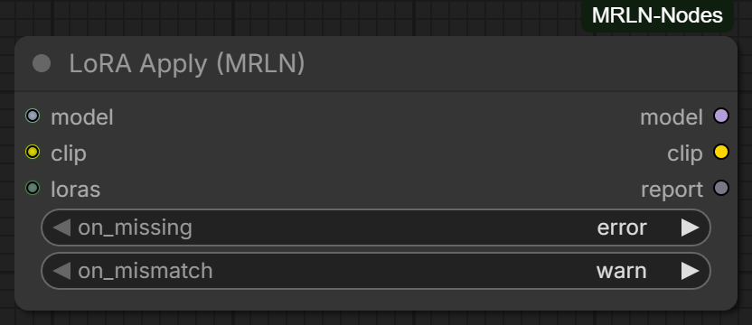

The idea: a LoRA belongs to the *item that needs it*, not to a loader you wire
by hand. Add a LoRA block to an item in the section editor, and every template
that can draw that item now loads it — automatically, at the strength its
author set, only on the draws that actually selected it.

Wire `loras` → this node, plus your `model` and `clip`. It:

- loads each drawn LoRA at its authored model/clip strength
- applies nothing at all when the draw selected none, so the graph always runs
- returns a `report` naming what it loaded

Two policies decide what happens when reality disagrees with the library:

| Widget | Options |
| --- | --- |
| `on_missing` | the file is not on this machine — **`error`** names it and stops (the safe default) · `skip` renders without it · `download` fetches it by AIR if it can |
| `on_mismatch` | the LoRA was trained for a different base model than the connected checkpoint (a FLUX LoRA on an SDXL one) — it loads without erroring but quietly degrades the image, so **`warn`** says so · `skip` leaves it out · `error` stops · `ignore` if you know better |

**What a LoRA looks like in the library.** `loralab/anime-style` is a shipped
section whose every item carries one:

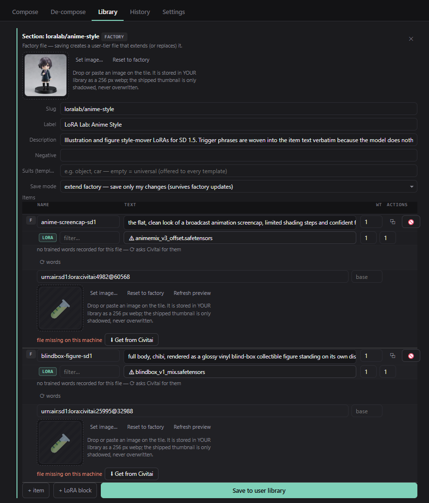

Per item: the **LoRA** tag, the `.safetensors` it needs (⚠ when this machine does
not have the file), its model and clip strengths, its trained words, its Civitai
AIR and a preview tile. **Get from Civitai** fetches a missing file by that AIR —
the same healing the node's `on_missing: download` performs at render time, and
the reason a shared bundle can rebuild itself on someone else's machine.

---

## Compose

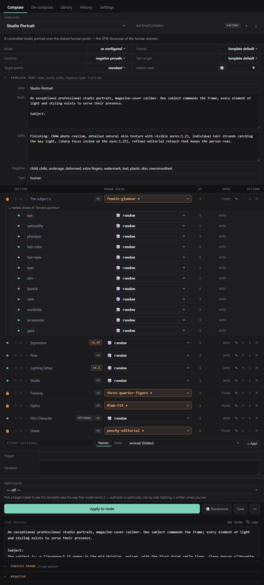

One screen, top to bottom: which template, how it renders, what each slot
drew, and what that produced.

### The template bar

`TEMPLATE` names the template; the **slug** beside it (`portrait/studio`) is
what the node's `template` widget holds — the one thing on this row you cannot
look up anywhere else. On the right: the tier pill, **＋** (start a new empty
template) and **⤓** (export it as a shareable bundle).

Clicking the name opens the picker:

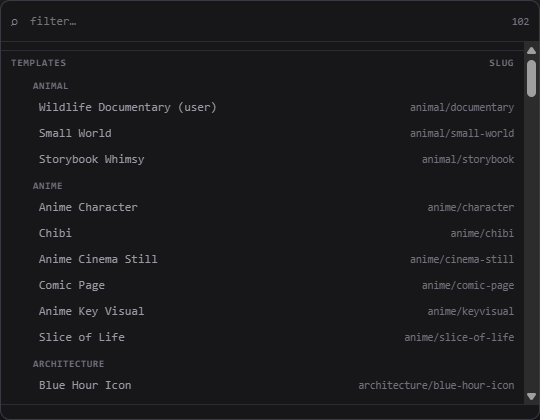

A filter over all 100 templates, grouped by folder, each row showing the slug
it will write. Type to narrow; ⏎ picks; Esc closes.

### The setup grid

`Mode`, `Format`, `Conflicts`, `Text length`, `Target profile`, `Master seed` —
these mirror the node's widgets exactly, so anything you change here is
something *Apply to node* will write. The dice rerolls the master seed.

`TEMPLATE TEXT` folds open the template's own prose: label, prefix, suffix,
negative and type classifiers.

### The draw table

One row per draw, and the columns mean:

| Column | |
| --- | --- |
| ◆ / 🔒 | **random** or **held**. Click to hold this draw on the seed it just used — and click again to let it roam |
| M · S | mute / solo, for auditioning. A muted slot renders as `off` |
| SECTION | the slot's label, its chips (`optional`, emphasis `×1.2`, `LoRA …`) |
| DRAWN VALUE | what it drew, or the item you pinned |
| WT | the drawn item's **draw weight** — how often it comes up relative to its siblings. Read-only here; it lives on the item in the Library |
| SEED | `auto` follows the master seed. Click to pin the seed this draw used, double-click to type one |
| ACTIONS | ✎ edit · ↑ ↓ reorder · ✕ remove |

**Click a row to select it**, then **E** edits, **↑ ↓** move it and **Del**
removes it. Enter or Escape lets it go, and so does clicking anywhere else.

#### Mute and solo — auditioning a prompt

The two letters on every row are borrowed from a mixing desk, and they mean the
same thing here.

- **M** mutes that slot. It renders as `off`, so its block leaves the prompt
  entirely — the way to answer *is this line actually doing anything?*
- **S** solos it. Everything else goes `off` instead, which answers the other
  question: *what does this block contribute on its own?* Solo several rows and
  you get that set together. Solo overrides mute.

This is an audition, not an edit. It changes no draw and no seed — clear it and
every row comes back exactly as it was, on the values it already had. Toggle M
on four rows, read the preview, toggle them off: nothing was lost.

A muted row dims, but its **M and S stay at full strength on purpose** — the one
control you need is the one that undoes the state you are looking at, and a
greyed-out button reads as a disabled button.

It does travel to the node: *Apply to node* writes muted slots into `selection`
as `slot=off`, because that is what they render as. So an audition you decide to
keep is already saved, and one you meant to undo should be cleared before you
apply.

### The value picker

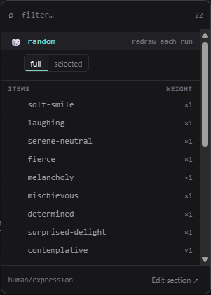

Clicking a value opens the panel's own list rather than a browser dropdown,
because a browser dropdown mixes two *modes* with 200+ items and offers no
search:

- **🎲 random** and **⊘ off** are pinned at the top and never filtered away —
  they are what the row *does*, not what it contains
- items carry their `×N` draw weight
- the foot names the section and links straight to it (**Edit section ↗**)
- ↑ ↓ walk, ⏎ commits, Esc closes, Tab leaves

### Random from a subset

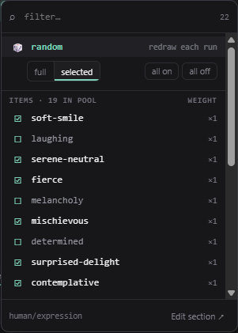

The `full` / `selected` switch on the random row is the interesting one.
**selected** turns every item into a tick box — random then draws only from
what is ticked, with **all on** / **all off** above the list and a running
count in the header (`ITEMS · 19 IN POOL`).

This is stored **on the template**, not on the node, so the node honours it
headless. An explicit pick is never restricted by it: if you name an item, you
get that item.

### Editing a row

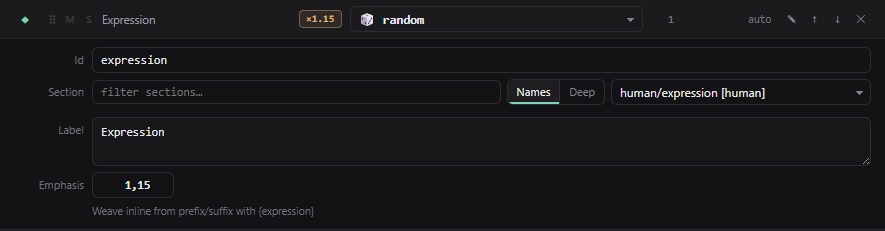

✎ (or **E**) opens four fields:

- **Id** — the `{placeholder}` this slot answers to. It is a *key*: it names
  the slot in the prefix/suffix prose, in the node's selection lines and in
  nested references, so renaming it here rewrites those references with it
- **Section** — which section the slot draws from, with the same filter the
  add-row uses. Changing it clears the slot's default (the old one named an
  item of the old section)
- **Label** — the name shown on the row *and* the lead-in rendered before the
  section's text. Empty falls back to the section's own label
- **Emphasis** — renders the drawn text as `(text:weight)`

### Preview, choices, apply

`LIVE PREVIEW` updates as you click and shows the term count. **CHOICES DRAWN**
is the same thing as a table — every slot, what it drew, and whether that was
`random` or `fixed`. Nested draws appear under their dotted path
(`configuration.model.hair-color`), so a draw three levels down still says
which slot it came from.

**Apply to node** writes the selection lines into a Prompt Template node.
**Randomize** rerolls, **Save** stores the template in your user library, and
**⋯** holds *Load from node*, *Pin draw* and *Save as…*.

**Which node it writes to.** With exactly one Prompt Template (MRLN) node in the
graph there is nothing to choose, so Apply targets it automatically — you do not
have to click it first. With **two or more**, select the one you mean on the
canvas; without a selection the panel refuses rather than guessing, and says so:
*"Add a Prompt Template (MRLN) node — with several in the graph, select the
target first."* The same rule governs *Load from node* and *Pin draw*, which
read from the same node Apply would write to.

### Variants

Some templates carry **variants**: alternative slot sets under one template,
picked by a row at the top of the table marked `@variant`. `animal/documentary`
has one per taxon — a mammal brief and a bird brief need different behaviour and
habitat pools, and forcing both through one slot list would produce neither.

Leave it on `random` and the variant is drawn like anything else, on the same
seed; pin it and the whole set below follows. A variant can add slots the base
template does not have, which is why the table can change shape when you switch.

### Optimize for

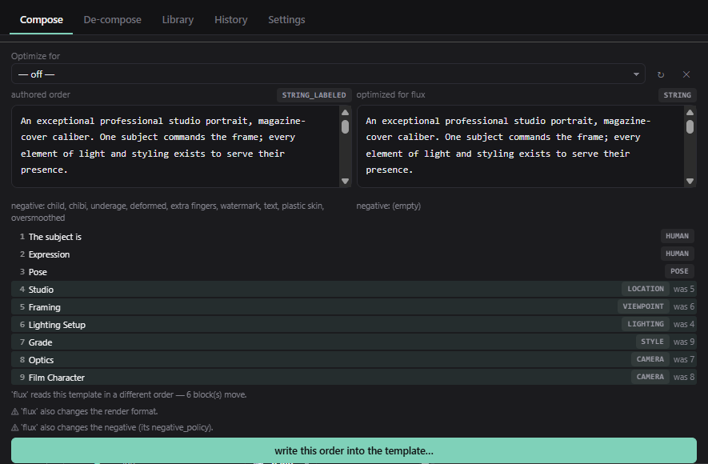

The same words in a different order are not the same prompt. Models weight
early tokens differently, some want the subject first and the camera last,
others the reverse — and a template cannot store a copy per target without
becoming a maintenance problem.

So reading order is a **render-time function of the profile**, and this is where
you see it. Pick a target and the panel renders the current and the target
version side by side:

- the two prompts, each with the **format** it would use (`STRING_LABELED`
  against `STRING` above)
- the two **negatives**, because a profile can carry its own negative policy
- the **reading order** underneath, one row per block, with `was 5` on every
  block that moved — six of nine here
- a plain-language summary: *'flux' reads this template in a different order —
  6 block(s) move*, plus a ⚠ for each thing that is **not** order (the render
  format, the negative policy)

Nothing is written. If you want the new order to be permanent, one explicit
button — *write this order into the template…* — copies it in. Otherwise the
comparison is just something you looked at, and the profile keeps doing the
reordering at render time.

### Profiles — telling it which model you are rendering with

`Target profile` in the setup grid is the same mechanism seen from the other
side. A profile is a named description of **what one model family rewards**, and
29 ship with the pack — `flux`, `krea2`, `sdxl`, `sd15`, `pony`, `illustrious`,
`qwen-image`, `zimage`, `chroma`, `hidream`, `ideogram4` and more.

Picking one is not picking "better". It changes four things, all at render time:

| Part | What it decides |
| --- | --- |
| `format` | tag list, plain string, labeled blocks — how this family likes to be addressed |
| `text_length` | whether each item renders its long form or its `text_short` |
| `block_order` | the reading order, per subject domain — the thing **Optimize for** previews |
| `negative_policy` | `keep`, or `drop` for families that do not use a negative prompt at all |

A profile can also carry an **LLM system prompt**, which is what leaves the
node's `llm` output — so `Prompt Enhance` rewrites in the idiom that family
wants rather than a generic one. A few carry more: `ideogram4` carries a JSON
caption scaffold, because that is how that model is addressed.

**Using them correctly comes down to four things.**

1. **Match the profile to the checkpoint you are actually rendering with.** A
   Flux-shaped prompt on SD 1.5 is a worse prompt, not a fancier one.
2. **Leave `Format` and `Text length` on `template default`.** Precedence is
   *explicit widget > profile > template*, so setting either one by hand takes
   that decision away from the profile — which is fine when you mean it, and
   silently defeats the profile when you do not.
3. **`standard` is the neutral baseline**, not a lesser option. It renders the
   template as written, and it is always the way back.
4. **Use *Optimize for* before committing.** It shows exactly what a profile
   would change — including the ⚠ lines for the things that are not order.

Some templates pin their own profile: the `showcase/*` ones each target one
model, so choosing the template has already chosen the target.

**They are yours to extend.** Profiles come from `profiles.json` in the factory
tier and in yours, and a template can carry its own under the same names — your
file extends the shipped one rather than replacing it. A template-level profile
may also carry an `overrides` block: a sparse per-profile *variant* of the
template (prefix, suffix, negative, and per-slot default or emphasis), so one
template can read differently for one target without a second copy on disk.

---

## De-compose

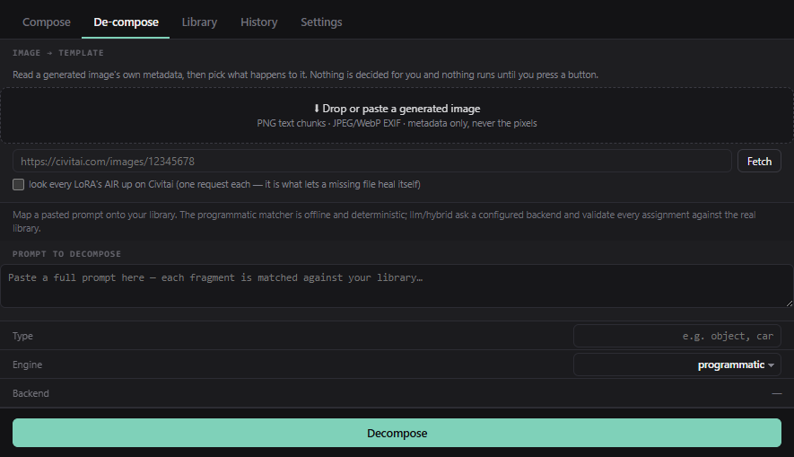

The other direction: start from a prompt or an image and end with a template.

**Image → template.** Drop a generated PNG/JPEG/WebP (or paste a civitai.com
URL) and its metadata is read server-side — A1111/Forge/Civitai `parameters`,
an embedded ComfyUI graph, or EXIF. Then *you* choose:

- **Use as-is** — a template that reproduces that prompt byte for byte. No LLM
  is involved, so it works with no backend configured
- **Decompose** — hand the text to the matcher below

**Prompt → template.** Paste a prompt and pick an engine:

- `programmatic` — offline token matching against your library
- `llm` — a configured backend splits and maps it, and every assignment is
  validated against the real library
- `hybrid` — the programmatic result rides along as suggestions to verify

Matched fragments become slots pinned to their items; the residue becomes new
items, new sections, or prefix/suffix prose — you decide per fragment. One
click saves the whole mapping as a template.

---

## Library


Everything the pack ships and everything you have made: 237 sections, 100
templates and the target-model profiles, each with a thumbnail. The view opens
as cards and remembers whichever you last chose (**☰ Rows** / **▦ Cards**).

The buttons across the top: **New section…**, **New combine…**, **New
template…**, **Import…** (a shared bundle), **Migrate…** (a wildcard folder,
a `.zip` pack or an A1111 `styles.csv`) and **Reload**.

Every row carries its tier — `FACTORY`, `USER`, or `FACTORY+USER` when your
file extends a shipped one — plus **⤓** export and, where there is a user file
to remove, **🗑**.

> **Reading what you are shadowing.** Where a slug exists in both tiers the
> tier pill is a *switch*: click it to read the factory version of a section or
> template your own file shadows. Your file still wins every render — the one
> exception is explicit, when you *Apply to node* from that factory view.

### Editing a section

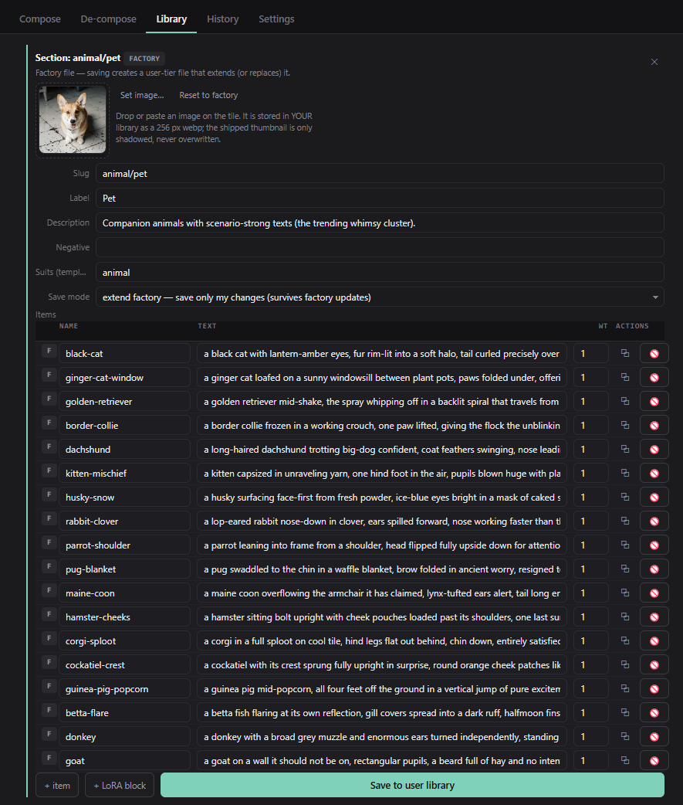

Clicking an entry opens its editor **directly under it**, with the rest of the
group stepped aside so it cannot open somewhere off-screen. Click the same
entry again to close it.

- **Thumbnail** — drop or paste an image; *Reset to factory* removes yours and
  the shipped tile comes back
- **Slug · Label · Description · Negative · Suits** — the section's own fields.
  `Suits` are the template classifiers this section serves; empty means
  universal
- **Save mode** — `extend factory` writes only your differences, so the shipped
  content keeps improving underneath you. `replace` shadows it entirely
- **Items** — `name`, `text`, `wt`. The `F`/`U` badge is the tier each item
  lives in; ⧉ duplicates and 🚫 hides a factory item (a tombstone, not a
  deletion — it can come back)
- **+ item** adds a row; **+ LoRA block** adds an item that carries a LoRA file
  and its strengths

<a id="nested-draws"></a>

### Nested draws: an item that draws its own slots

This is the pack's most powerful idea and the least obvious one.

**An item's text can contain `{placeholders}` of its own.** When it does, the
item declares *child slots*, and drawing that item draws its children too — so
one pick can expand into a dozen coordinated draws.

Look back at the [Compose screenshot](#compose): the first row drew
`female-glamour` from `human/profile`, and underneath it sits **↳ nested draws
of 'female-glamour'** — age, nationality, physique, hair colour, hair style,
eyes, skin, lipstick, nails, wardrobe, accessories, gaze. Each is a real draw
with its own state, seed and picker. The tree line shows the depth, and it
nests as deep as you build it.

**To build one:**

1. Open the section that will hold the composite item (or **New section…**).
2. In an item's `text`, type `{` — an assist lists the child ids already in
   use. Type a new name and close the brace, e.g.
   `a woman in {wardrobe}, {hair-style}, {gaze}`.
3. The editor turns each new `{placeholder}` into a **child slot** row under
   that item. For each one, pick the **section** it draws from, and optionally
   a default and tag filters.
4. Save. Any template with a slot pointing at this section now draws the whole
   family from one pick.

Two rules worth knowing, both learned the hard way:

- **Do not restate an axis the subject already draws.** If your item nests its
  own `wardrobe`, the template must not also carry a `wardrobe` slot — two
  wardrobes reach the prompt and the model picks one. The test suite refuses
  this combination.
- **A child slot is addressed by its path.** `configuration.model.hair-color`
  is a legal selection line, so a node can pin a draw three levels down.

<a id="combine"></a>

### Combine: one slot, several sections

**New combine…** builds a section whose items are *delegations* rather than
text: pick several sections, give each a weight, and every entry points at its
source.

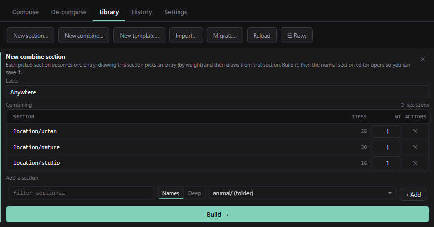

A slot pointing at that section then draws "urban **or** nature **or** studio",
in the proportion you set. Re-opening a combine section returns to this
pick-and-weight view rather than a table of `{pick}` rows.

<a id="building-a-template"></a>

### Building a template from scratch

1. **New template…** — give it a slug (`mine/portrait-study`) and a label.
2. It opens in **Compose** with no slots. Use the **add-section row** under the
   table: filter by name (or switch to **Deep** to search *inside* sections),
   pick one, **+ Add**.
3. Each added slot gets an id from the section name. Open ✎ to rename it,
   choose a default, or set emphasis.
4. Write the prose in `TEMPLATE TEXT`: `prefix` runs before the blocks,
   `suffix` after. Mention a slot's `{id}` in either and that slot's drawn text
   is *woven into the sentence* instead of joining the block list — the row
   shows an `inline` chip when this is happening.
5. **Save** writes it to your user library. **⤓** exports it with every user
   section it depends on.

### Sharing a template — export and import

This is how a template you built travels to someone else, and it is worth
knowing about before you need it.

**⤓ Export** sits on every template and section row. It writes a `.mrln.json`
**bundle** containing:

- the template itself
- every **user-tier** section it draws from — and only those, because factory
  content resolves on the other machine, which keeps the file small
- the **Civitai AIR** of every LoRA any of those sections declares

So the recipient gets your composition, your wording, and a resolvable pointer
to the weights — not a copy of the weights. Share the bundle next to your
workflow and they can rebuild your renders end to end.

**Import…** takes one back. It **dry-runs first**: you see the exact write/skip
plan before anything touches disk, colliding files are kept unless you tick
overwrite, and opening the imported template offers to download any LoRA the
machine is missing (by AIR, verified against the SHA256 Civitai publishes).

**Migrate…** is the same plan preview for content that was never MRLN's:

| Source | What happens |
| --- | --- |
| A wildcard folder of `.txt` / `.yaml` files | each file becomes a section, each line an item; weighted lines (`3::rare option`) keep their weight |
| The `.zip` a published wildcard pack ships as | same, unpacked for you |
| An A1111 `styles.csv` | each style becomes an item, its positive and negative kept together |
| A Civitai **Wildcards** model link | downloaded, checked against the SHA256 Civitai publishes, then planned like any other import — with the creator's licence terms shown *before* anything is written |

The plan says plainly which third-party syntax survives the trip and which does
not, so you find out before the import rather than after.

---

## History

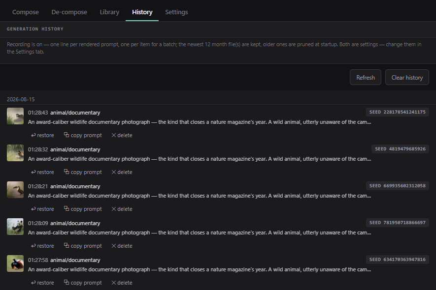

Every render the node makes is one line, newest first: the template, the seed,
the mode and what was drawn. **Restore** puts all nine inputs back — template,
profile, seed, mode, selection, variables, format, length and conflict policy —
so it reproduces the render rather than approximating it. A batch collapses to
one row. Recording and retention are in Settings; clearing is a two-step
confirm.

### The thumbnail on each row

After a few thousand prompts you rarely remember the date — you remember the
picture. So each row carries a mini thumbnail of the render it produced.

**Nothing needs wiring for this.** ComfyUI writes the whole executed graph into
every PNG it saves, and that graph contains the Prompt Template node with its
`template` and `seed` — the same pair the history line already records. The
image therefore identifies itself, and the panel simply looks for the one whose
template and seed match the row. A useful side effect: it works on renders that
are already on your disk, including ones made long before this feature existed.

**Hover a tile to see it bigger.** Tiles are stored at 64 px and shown at 34,
so hovering shows the file at its own resolution rather than an upscale. It
grows over the rows around it without moving them.

What it costs is deliberately close to nothing: the tiles load only as rows
scroll into view, the match index is built a little at a time and stored (and
primed once when ComfyUI starts, so the first visit is not the slow one), and
each tile is a ~1 KB webp cached after the first look.

Two cases show no thumbnail, on purpose — a wrong picture next to a prompt is
worse than none:

- **Batches that vary the seed.** Each item is its own history line, but the
  saved graph records only the node's base seed, so the first item matches and
  the rest do not.
- **A seed fed from another node.** The graph then stores a wire rather than a
  number, and there is nothing to match on.

A row whose image was deleted, moved, or never saved simply shows no tile.
Turn the whole thing off with **Show thumbnails** in Settings.

### Removing records

**✕ delete** on a row removes that one record and the thumbnail cached for it.
It arms first, like every destructive action here, so it takes two clicks. The
rendered image on disk is **not** touched — only the history line and the small
cached tile.

**Clear history** removes every month file, and now the cached tiles with them:
pictures of the renders you just cleared should not outlive the records.

---

## Settings

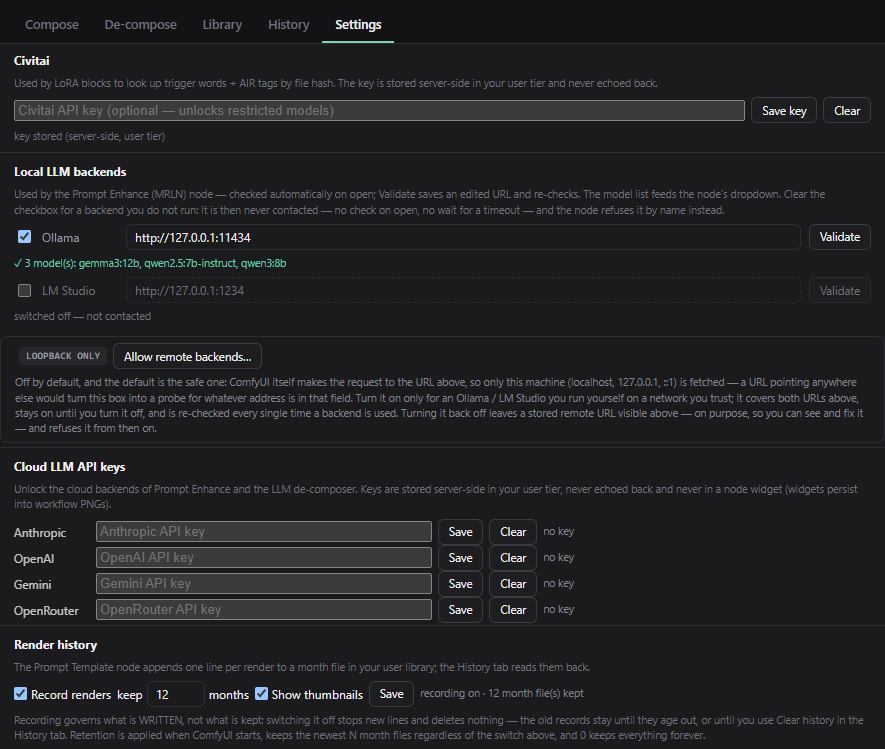

- **Civitai API key** — stored server-side in your user tier, never echoed back
  and never written into a workflow. Everything that talks to Civitai goes
  through it:

  | Feature | Without a key | With a key |
  | --- | --- | --- |
  | LoRA lookup by file hash — trigger words, AIR, base family | works for public models | also reaches models that need an account |
  | **Get from Civitai** / `on_missing: download` | public downloads work | required for anything gated behind an account |
  | LoRA preview images on tiles | public previews work | same, and fewer rate limits |
  | **Migrate…** a Civitai *Wildcards* pack | public packs work | required for packs that need an account |
  | De-compose from a `civitai.com/images/…` link | public images work | required for images behind an account |

  When Civitai answers 401 or 403, the panel says so and points at this field
  rather than failing silently. A key is never needed for anything that stays on
  your own machine
- **Local LLM backends** — Ollama and LM Studio URLs, validated on open with
  the model list they report. **Clear a backend's checkbox and it is never
  contacted** — no check on open, no wait for a timeout, and the Enhance node
  refuses it by name instead
- **Allow remote backends** — off by default, and the default is the safe one:
  *ComfyUI itself* makes the request, so a non-loopback URL turns this box into
  a probe for whatever address is in the field
- **Cloud LLM API keys** — Anthropic, OpenAI, Gemini, OpenRouter. Server-side,
  never echoed back, never written into a workflow
- **Render history** — whether renders are recorded, how many month files to
  keep, and whether each row shows a thumbnail of the render it made

---

## Recipes

Short end-to-end answers to the things people actually want to do.

### Keep one thing, re-roll everything else

Open **Compose**, click the value you want to keep and pick it explicitly (or
click its ◆ to hold it on the seed it just used). Then hit **🎲 Randomize** as
often as you like: held and pinned rows do not move. **Apply to node** writes
exactly that state into `selection`, so the node reproduces it headless.

### Get eight different prompts from one queue

Set `batch_count` to 8 on the node. This is eight *draws*, not eight copies —
every random slot moves each time, and every pinned one stays.

`batch_mode` decides how it walks:

- **`increment seed`** — image *i* is drawn at `seed + i`. The usual choice, and
  reproducible: any image in the batch can be recreated on its own seed.
- **`combinatorial`** — ignores the count and enumerates *every combination* of
  the slots still on random, capped at 512. Pin everything except two slots and
  you get their full cross product: the way to see a whole axis at once rather
  than sampling it.

Every output is a list either way, and a length-1 list is indistinguishable from
a single value downstream — so wiring a batch changes nothing about the graph.

### Make "random" mean random from a short list

In the value picker, switch `full` → `selected` and tick the items you want.
The header counts the live pool (`ITEMS · 19 IN POOL`). This is stored on the
**template**, so the node honours it with the panel closed. Naming an item
explicitly always beats the whitelist.

### Add your own wording to a shipped section

Open the section in **Library**, leave **Save mode** on `extend factory`, add
items at the bottom, save. You now own a small user file holding *only your
additions* — the factory items still come from the pack, so a pack update
still reaches you. To retire a factory item rather than add one, tombstone it
(`hidden`) instead of editing it in place.

### Make an item load its own LoRA

In the section editor, click **+ LoRA block** on the item's row and fill in the
file and strengths. Wire the node's `loras` output to **LoRA Apply (MRLN)**.
From now on, any template that draws that item loads that LoRA, and its trigger
words are in the prompt because they are part of the item's text.

### Run it through a local LLM without risking the render

Wire `llm` → **Prompt Enhance (MRLN)**. Set the backend and model, leave
`on_error` on `pass through`, and set `free_vram` to `after call`. If Ollama is
not running, the original prompt goes through unchanged and the `report` says
why — the queue never dies for want of an LLM.

### Reproduce a render from last week

**History** → find the row → **Restore**. All nine inputs come back (template,
profile, seed, mode, selection, variables, format, length, conflict policy), so
it reproduces the render rather than approximating it.

### Turn a prompt you already have into library content

**De-compose** → paste the prompt → it proposes which parts are which and lets
you file them as items in sections you choose. Good for importing your own
back catalogue without retyping it.

---

## What survives a pack update

A fair question before you invest in your own content:

| You did this | A factory update… |
| --- | --- |
| Extended a factory section | leaves it alone — your file holds only your additions and the factory items keep flowing in |
| Pinned an item by name | keeps working while that item exists. If it is renamed or removed, the draw falls back to a **seeded random** and says so in `choices` (with a "did you mean…" hint) rather than failing the queue |
| Left a slot random | draws **differently** if the section gained or lost items — a weighted draw is over the live pool, and that is the price of a library that can grow. Pin what must not move |
| Referenced a section that was renamed | follows an alias automatically; nothing to do |
| Referenced a section that was deleted | renders without that slot and warns in `choices`, instead of dying |

The Section node is deliberately stricter: it raises instead of falling back,
because a node whose entire job is one named item should not quietly hand you
a different one.

---

## Where things live

| | |
| --- | --- |
| Your library | `<ComfyUI>/user/mrln/prompt/` — survives pack updates |
| Shipped library | `mrln/data/prompt/` inside the pack |
| Endpoints | `/mrln/prompt/*`, registered only inside a running ComfyUI |

Same-name **sections compound**: your file extends the factory one (same item
name wins, new items append, `"hidden": true` tombstones one). Same-name
**templates replace** the factory file entirely.

If the sidebar API is not available in your frontend, the panel simply does not
appear — the nodes work identically without it.
