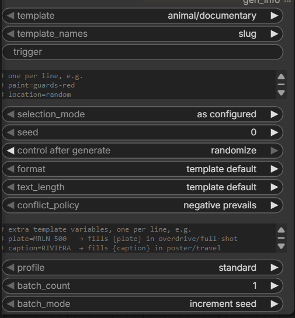
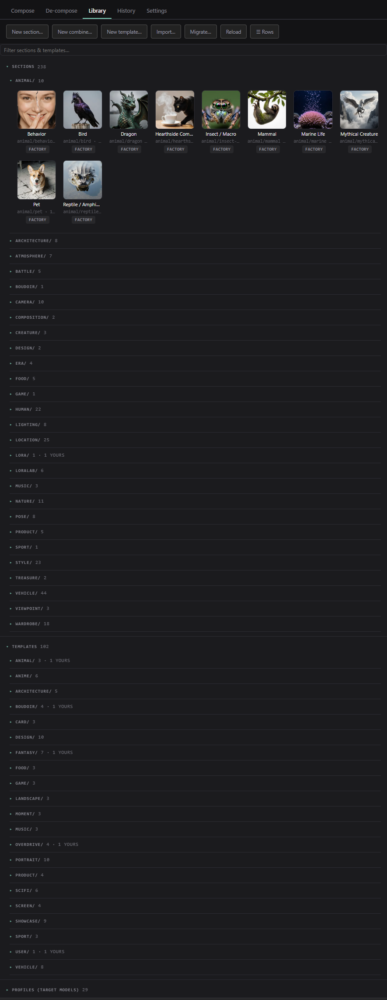
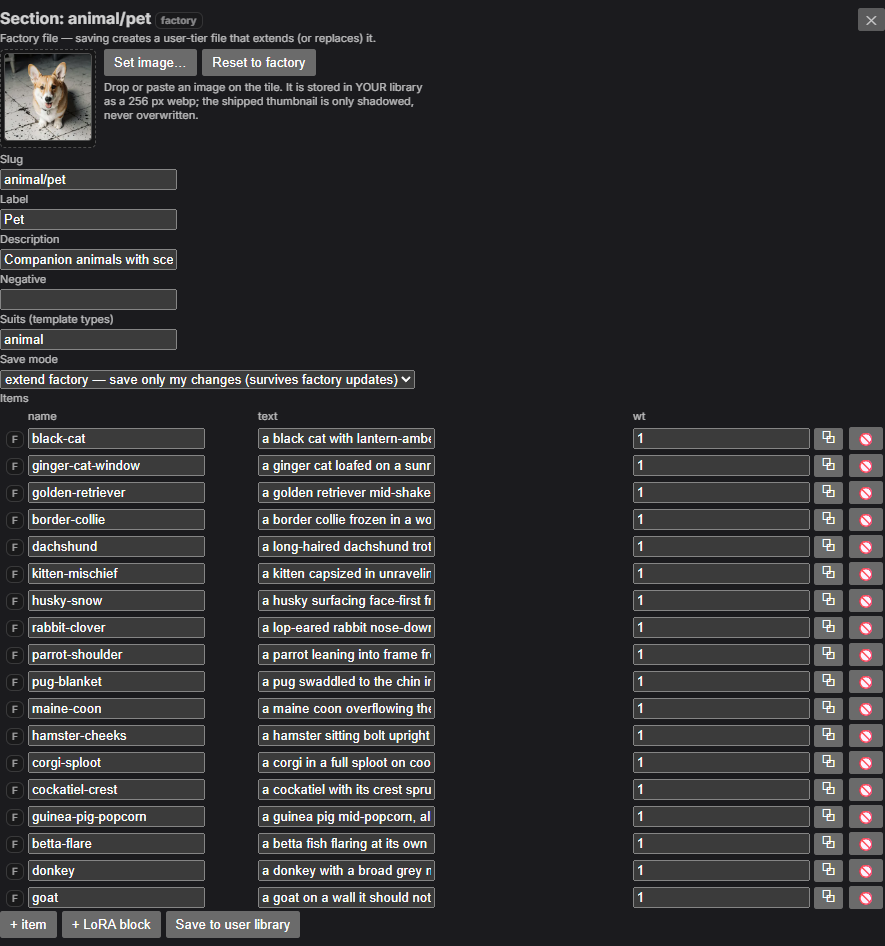
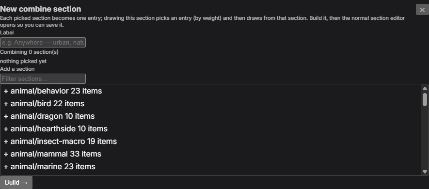
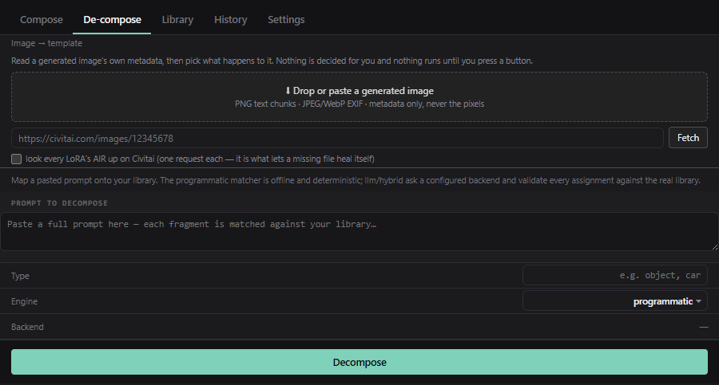

# The Prompt Composer — a guide

The Composer is a sidebar panel (the book icon) that browses the prompt
library, composes a prompt from it, and writes the result into a **Prompt
Template (MRLN)** node. Nothing it does is magic: everything you see here ends
up as plain JSON in your user library and plain text in the node, so a
workflow you share still runs on a machine that has never opened this panel.

This guide walks the five tabs in the order you meet them, then covers the two
things that are hard to discover on your own — **nested draws** and **combine
sections**.

- [The node itself](#the-node-itself)
- [Compose](#compose)
  - [The template bar](#the-template-bar)
  - [The setup grid](#the-setup-grid)
  - [The draw table](#the-draw-table)
  - [The value picker](#the-value-picker)
  - [Random from a subset](#random-from-a-subset)
  - [Editing a row](#editing-a-row)
  - [Preview, choices, apply](#preview-choices-apply)
- [Library](#library)
  - [Editing a section](#editing-a-section)
  - [Nested draws: an item that draws its own slots](#nested-draws)
  - [Combine: one slot, several sections](#combine)
  - [Building a template from scratch](#building-a-template)
- [De-compose](#de-compose)
- [History](#history)
- [Settings](#settings)

---

## The node itself

The panel is a convenience. The node is the contract, and it reads top to
bottom in the order the work happens:

| Widget | What it decides |
| --- | --- |
| `template` | which composition to render |
| `template_names` | whether the widget above lists **slugs** (`portrait/studio` — the stable identifier, and what a shared workflow should carry) or **labels** (`Studio Portrait`) |
| `trigger` | fills `{trigger}` everywhere — usually your LoRA's trained word |
| `selection` | one `slot=value` per line; this is what *Apply to node* writes |
| `selection_mode` | `as configured` honours those lines · `randomize all` re-rolls everything · `all fixed defaults` pins every slot to its template default |
| `seed` | every random slot is derived from it, so the same seed and library always draw the same prompt |
| `format`, `text_length`, `conflict_policy` | the shape of what comes out |
| `variables`, `profile`, `batch_count`, `batch_mode` | extra `{name}=value` lines, the target-model profile, and batching |

Outputs are grouped by what you wire them to: **`prompt`**, **`llm`**,
**`loras`** first, then the reports **`negative`**, **`choices`**,
**`gen_info`**.

---

## Compose

One screen, top to bottom: which template, how it renders, what each slot
drew, and what that produced.

### The template bar

`TEMPLATE` names the template; the **slug** beside it (`portrait/studio`) is
what the node's `template` widget holds — the one thing on this row you cannot
look up anywhere else. On the right: the tier pill, **＋** (start a new empty
template) and **⤓** (export it as a shareable bundle).

Clicking the name opens the picker:

A filter over all 100 templates, grouped by folder, each row showing the slug
it will write. Type to narrow; ⏎ picks; Esc closes.

### The setup grid

`Mode`, `Format`, `Conflicts`, `Text length`, `Target profile`, `Master seed` —
these mirror the node's widgets exactly, so anything you change here is
something *Apply to node* will write. The dice rerolls the master seed.

`TEMPLATE TEXT` folds open the template's own prose: label, prefix, suffix,
negative and type classifiers.

### The draw table

One row per draw, and the columns mean:

| Column | |
| --- | --- |
| ◆ / 🔒 | **random** or **held**. Click to hold this draw on the seed it just used — and click again to let it roam |
| M · S | mute / solo, for auditioning. A muted slot renders as `off` |
| SECTION | the slot's label, its chips (`optional`, emphasis `×1.2`, `LoRA …`) |
| DRAWN VALUE | what it drew, or the item you pinned |
| WT | the drawn item's **draw weight** — how often it comes up relative to its siblings. Read-only here; it lives on the item in the Library |
| SEED | `auto` follows the master seed. Click to pin the seed this draw used, double-click to type one |
| ACTIONS | ✎ edit · ↑ ↓ reorder · ✕ remove |

**Click a row to select it**, then **E** edits, **↑ ↓** move it and **Del**
removes it. Enter or Escape lets it go, and so does clicking anywhere else.

### The value picker

Clicking a value opens the panel's own list rather than a browser dropdown,
because a browser dropdown mixes two *modes* with 200+ items and offers no
search:

- **🎲 random** and **⊘ off** are pinned at the top and never filtered away —
  they are what the row *does*, not what it contains
- items carry their `×N` draw weight
- the foot names the section and links straight to it (**Edit section ↗**)
- ↑ ↓ walk, ⏎ commits, Esc closes, Tab leaves

### Random from a subset

The `full` / `selected` switch on the random row is the interesting one.
**selected** turns every item into a tick box — random then draws only from
what is ticked, with **all on** / **all off** above the list and a running
count in the header (`ITEMS · 19 IN POOL`).

This is stored **on the template**, not on the node, so the node honours it
headless. An explicit pick is never restricted by it: if you name an item, you
get that item.

### Editing a row

✎ (or **E**) opens four fields:

- **Id** — the `{placeholder}` this slot answers to. It is a *key*: it names
  the slot in the prefix/suffix prose, in the node's selection lines and in
  nested references, so renaming it here rewrites those references with it
- **Section** — which section the slot draws from, with the same filter the
  add-row uses. Changing it clears the slot's default (the old one named an
  item of the old section)
- **Label** — the name shown on the row *and* the lead-in rendered before the
  section's text. Empty falls back to the section's own label
- **Emphasis** — renders the drawn text as `(text:weight)`

### Preview, choices, apply

`LIVE PREVIEW` updates as you click and shows the term count. **CHOICES DRAWN**
is the same thing as a table — every slot, what it drew, and whether that was
`random` or `fixed`. Nested draws appear under their dotted path
(`configuration.model.hair-color`), so a draw three levels down still says
which slot it came from.

**Apply to node** writes the selection lines into the selected Prompt Template
node. **Randomize** rerolls, **Save** stores the template in your user library,
and **⋯** holds *Load from node*, *Pin draw* and *Save as…*.

---

## Library

Everything the pack ships and everything you have made: 237 sections, 100
templates and the target-model profiles, each with a thumbnail. The view opens
as cards and remembers whichever you last chose (**☰ Rows** / **▦ Cards**).

The buttons across the top: **New section…**, **New combine…**, **New
template…**, **Import…** (a shared bundle), **Migrate…** (a wildcard folder,
a `.zip` pack or an A1111 `styles.csv`) and **Reload**.

Every row carries its tier — `FACTORY`, `USER`, or `FACTORY+USER` when your
file extends a shipped one — plus **⤓** export and, where there is a user file
to remove, **🗑**.

> **Reading what you are shadowing.** Where a slug exists in both tiers the
> tier pill is a *switch*: click it to read the factory version of a section or
> template your own file shadows. Your file still wins every render — the one
> exception is explicit, when you *Apply to node* from that factory view.

### Editing a section

Clicking an entry opens its editor **directly under it**, with the rest of the
group stepped aside so it cannot open somewhere off-screen. Click the same
entry again to close it.

- **Thumbnail** — drop or paste an image; *Reset to factory* removes yours and
  the shipped tile comes back
- **Slug · Label · Description · Negative · Suits** — the section's own fields.
  `Suits` are the template classifiers this section serves; empty means
  universal
- **Save mode** — `extend factory` writes only your differences, so the shipped
  content keeps improving underneath you. `replace` shadows it entirely
- **Items** — `name`, `text`, `wt`. The `F`/`U` badge is the tier each item
  lives in; ⧉ duplicates and 🚫 hides a factory item (a tombstone, not a
  deletion — it can come back)
- **+ item** adds a row; **+ LoRA block** adds an item that carries a LoRA file
  and its strengths

### Nested draws: an item that draws its own slots

This is the pack's most powerful idea and the least obvious one.

**An item's text can contain `{placeholders}` of its own.** When it does, the
item declares *child slots*, and drawing that item draws its children too — so
one pick can expand into a dozen coordinated draws.

Look back at the [Compose screenshot](#compose): the first row drew
`female-glamour` from `human/profile`, and underneath it sits **↳ nested draws
of 'female-glamour'** — age, nationality, physique, hair colour, hair style,
eyes, skin, lipstick, nails, wardrobe, accessories, gaze. Each is a real draw
with its own state, seed and picker. The tree line shows the depth, and it
nests as deep as you build it.

**To build one:**

1. Open the section that will hold the composite item (or **New section…**).
2. In an item's `text`, type `{` — an assist lists the child ids already in
   use. Type a new name and close the brace, e.g.
   `a woman in {wardrobe}, {hair-style}, {gaze}`.
3. The editor turns each new `{placeholder}` into a **child slot** row under
   that item. For each one, pick the **section** it draws from, and optionally
   a default and tag filters.
4. Save. Any template with a slot pointing at this section now draws the whole
   family from one pick.

Two rules worth knowing, both learned the hard way:

- **Do not restate an axis the subject already draws.** If your item nests its
  own `wardrobe`, the template must not also carry a `wardrobe` slot — two
  wardrobes reach the prompt and the model picks one. The test suite refuses
  this combination.
- **A child slot is addressed by its path.** `configuration.model.hair-color`
  is a legal selection line, so a node can pin a draw three levels down.

### Combine: one slot, several sections

**New combine…** builds a section whose items are *delegations* rather than
text: pick several sections, give each a weight, and every entry points at its
source.

A slot pointing at that section then draws "urban **or** nature **or** studio",
in the proportion you set. Re-opening a combine section returns to this
pick-and-weight view rather than a table of `{pick}` rows.

### Building a template from scratch

1. **New template…** — give it a slug (`mine/portrait-study`) and a label.
2. It opens in **Compose** with no slots. Use the **add-section row** under the
   table: filter by name (or switch to **Deep** to search *inside* sections),
   pick one, **+ Add**.
3. Each added slot gets an id from the section name. Open ✎ to rename it,
   choose a default, or set emphasis.
4. Write the prose in `TEMPLATE TEXT`: `prefix` runs before the blocks,
   `suffix` after. Mention a slot's `{id}` in either and that slot's drawn text
   is *woven into the sentence* instead of joining the block list — the row
   shows an `inline` chip when this is happening.
5. **Save** writes it to your user library. **⤓** exports it with every user
   section it depends on.

---

## De-compose

The other direction: start from a prompt or an image and end with a template.

**Image → template.** Drop a generated PNG/JPEG/WebP (or paste a civitai.com
URL) and its metadata is read server-side — A1111/Forge/Civitai `parameters`,
an embedded ComfyUI graph, or EXIF. Then *you* choose:

- **Use as-is** — a template that reproduces that prompt byte for byte. No LLM
  is involved, so it works with no backend configured
- **Decompose** — hand the text to the matcher below

**Prompt → template.** Paste a prompt and pick an engine:

- `programmatic` — offline token matching against your library
- `llm` — a configured backend splits and maps it, and every assignment is
  validated against the real library
- `hybrid` — the programmatic result rides along as suggestions to verify

Matched fragments become slots pinned to their items; the residue becomes new
items, new sections, or prefix/suffix prose — you decide per fragment. One
click saves the whole mapping as a template.

---

## History

Every render the node makes is one line, newest first: the template, the seed,
the mode and what was drawn. **Restore** puts all nine inputs back — template,
profile, seed, mode, selection, variables, format, length and conflict policy —
so it reproduces the render rather than approximating it. A batch collapses to
one row. Recording and retention are in Settings; clearing is a two-step
confirm.

---

## Settings

- **Civitai** — an optional API key for LoRA lookups. Stored server-side in
  your user tier and never echoed back
- **Local LLM backends** — Ollama and LM Studio URLs, validated on open with
  the model list they report. **Clear a backend's checkbox and it is never
  contacted** — no check on open, no wait for a timeout, and the Enhance node
  refuses it by name instead
- **Allow remote backends** — off by default, and the default is the safe one:
  *ComfyUI itself* makes the request, so a non-loopback URL turns this box into
  a probe for whatever address is in the field
- **Cloud LLM API keys** — Anthropic, OpenAI, Gemini, OpenRouter. Server-side,
  never echoed back, never written into a workflow
- **Render history** — whether renders are recorded, and how many month files
  to keep

---

## Where things live

| | |
| --- | --- |
| Your library | `<ComfyUI>/user/mrln/prompt/` — survives pack updates |
| Shipped library | `mrln/data/prompt/` inside the pack |
| Endpoints | `/mrln/prompt/*`, registered only inside a running ComfyUI |

Same-name **sections compound**: your file extends the factory one (same item
name wins, new items append, `"hidden": true` tombstones one). Same-name
**templates replace** the factory file entirely.

If the sidebar API is not available in your frontend, the panel simply does not
appear — the nodes work identically without it.
